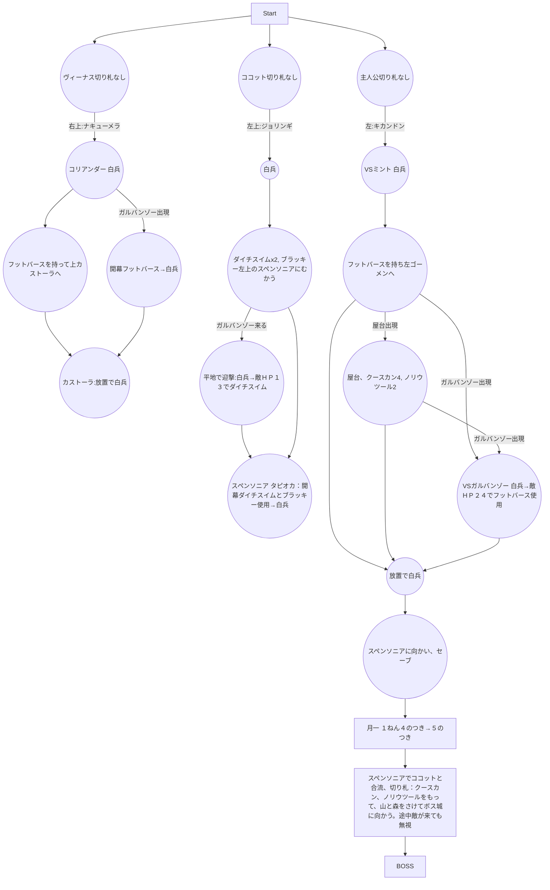
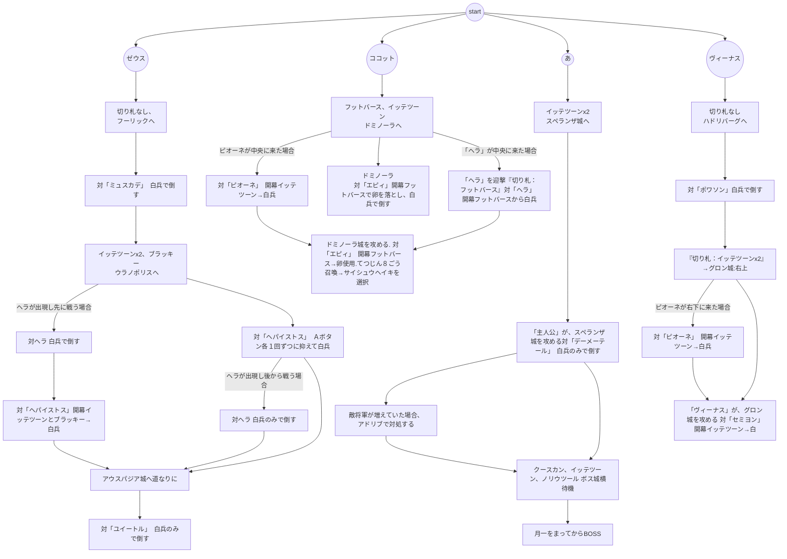

# 転記元： http://blog.livedoor.jp/hanjukueiyu/
# 前提

## 切り札の卵落ち判定
切り札使用時に敵将軍が卵を落とすかどうかは確率ではなく、ある判定で決まっています。

【(自軍将軍の最大ＨＰ＋敵将軍の最大ＨＰ)÷16】の余りが、切り札毎に設定されている【卵落ち値】以下
の場合に、卵を確実に落とします。

イッテツーンは余り７以下、ブラッキーは余り２以下、グリンボーは余り３以下、をよく使います。


# 1


## 月一イベント:１ねん４のつき→５のつき　
- ２１４Ｇ　+114Ｇ
- 凶作、あたしのおねだり　はリセット 
- ※もし月イチイベントで将軍が雇えた場合 賃金の分、イッテツーンと兵士補充を減らす
- イッテツーンは最低でも６個は購入 足りない場合は兵士補充を減らす

### 切り札購入 
- イッテツーン　　９個　-9Ｇ
-　ノリウツール　　２個　-36Ｇ
- クースカン　　　４個　-96Ｇ
- ゼンマイン　　　１個　-32Ｇ
- 兵士補充　　　　４１人　-41Ｇ"]
	
## BOSS 「クイーン」
- ①白兵で一回ぶつかり合う
- ②壁に当てずに、すぐにクースカンを使用
- ③続けてノリウツールを使用して撃破

```
【①クイーン＋兵士６人－ぶつかり合い＝７０＋(６０－７)＝１２３】
【②クイーン＋兵士６人－クースカン＝(７０÷２)＋{(５３－２０)÷２}＝５１】
【③クイーン＋兵士４人－ノリウツール＝３５＋１６－５３＝０以下】
```

# 2

## 月一 １ねん５のつき→６のつき　
-２９４Ｇ　+284Ｇ 凶作が来たらリセット
### 切り札購入　
- グリンボー　１１個　-66Ｇ
- ミックミー　２個　-80Ｇ
### 兵士補充　
- ７１人　-71Ｇ
＞も～おしまい　　残り７７Ｇ

## ＢＯＳＳ：「にせヒーロー」
- ＨＰ：９０　戦闘：１４　兵士ＨＰ：１０
- ①開幕クースカン使用
- ②続けてイッテツーン使用
- ③続けてノリウツール使用して撃破
```
【①にせヒーロー＋兵士６人－クースカン＝(９０÷２)＋{(６０－２０)÷２}＝６５】
【②にせヒーロー＋兵士４人－イッテツーン＝４５＋２０－１６＝４９】
【③にせヒーロー＋兵士１人－ノリウツール＝４５＋４－５３＝０以下】
```

