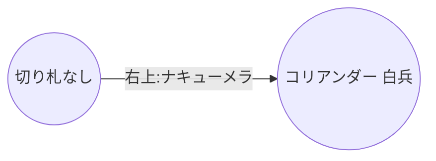
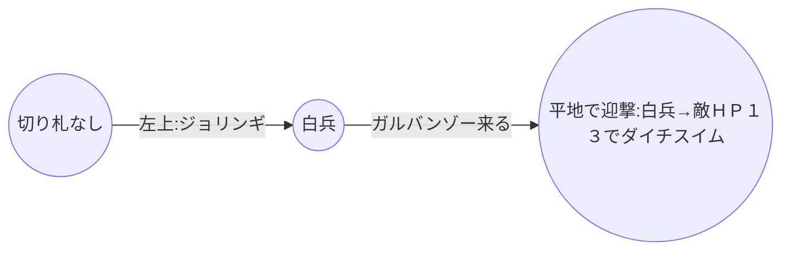
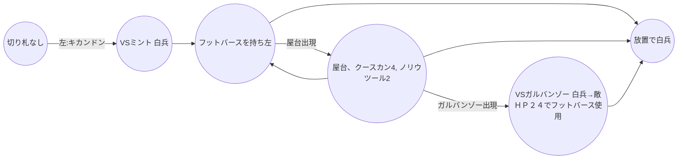

## 1
### V

```mermaid
graph LR
	A((切り札なし))--右上:ナキューメラ-->B((コリアンダー 白兵))
	
```
### C

```mermaid
graph LR
	A((切り札なし))--左上:ジョリンギ-->B((白兵))
	B--ガルバンゾー来る-->C((平地で迎撃:白兵→敵ＨＰ１３でダイチスイム))
	
```
### S

```mermaid
graph LR
	A((切り札なし))--左:キカンドン-->B((VSミント 白兵))
	B-->C((フットバースを持ち左))
	C--屋台出現-->D((屋台、クースカン4, ノリウツール2))
	C-->E((放置で白兵))
	D--ガルバンゾー出現-->F((VSガルバンゾー 白兵→敵ＨＰ２４でフットバース使用))
	D-->E
	F-->E
	D-->C
```
