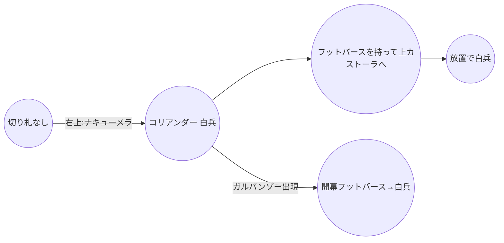
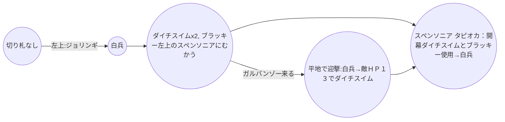

## 1
### V

### C

### S
```mermaid
graph TB
	A((切り札なし))--左:キカンドン-->B((VSミント 白兵))
	B-->C((フットバースを持ち左ゴーメンへ))
	C--屋台出現-->D((屋台、クースカン4, ノリウツール2))
	C-->E((放置で白兵))
	C--ガルバンゾー出現-->F((VSガルバンゾー 白兵→敵ＨＰ２４でフットバース使用))
	D--ガルバンゾー出現-->F
	D-->E
	F-->E
	E-->G((スペンソニアに向かい、セーブ))
	G-->H(("月一イベント:１ねん４のつき→５のつき　２１４Ｇ　+114Ｇ
			凶作、あたしのおねだり　はリセット
			※もし月イチイベントで将軍が雇えた場合
			賃金の分、イッテツーンと兵士補充を減らす。
			イッテツーンは最低でも６個は購入。
			足りない場合は兵士補充を減らす。"
			))
	H-->J(("切り札購入
	　イッテツーン　　９個　-9Ｇ
	　ノリウツール　　２個　-36Ｇ
	　クースカン　　　４個　-96Ｇ
	　ゼンマイン　　　１個　-32Ｇ
	兵士補充　　　　４１人　-41Ｇ))
	J-->K(("スペンソニアでココットと合流、切り札：クースカン、ノリウツールをもって、山と森をさけてボス城に向かう。途中敵が来ても無視"))
	K-->L(("ＢＯＳＳ：「クイーン」
		ＨＰ：７０　戦闘：１３　兵士ＨＰ：１０
		 卵を使わせず、卵を使わずに倒す。
		①白兵で一回ぶつかり合う
		②壁に当てずに、すぐにクースカンを使用
		③続けてノリウツールを使用して撃破"
		))
```

## 2
