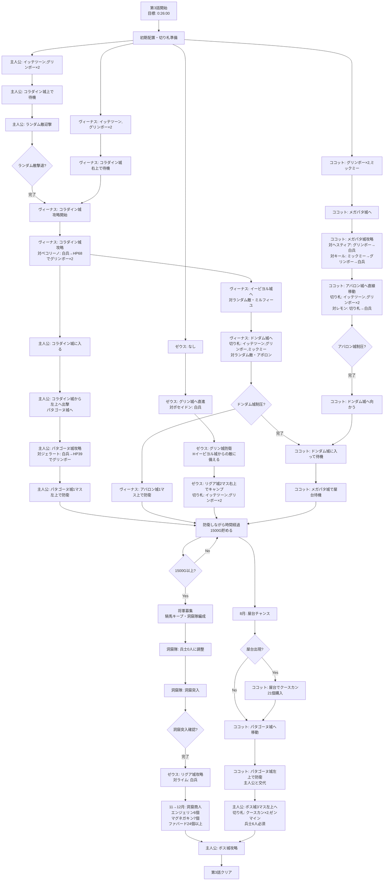

# 転記元： http://blog.livedoor.jp/hanjukueiyu/
# 全体知識

## 切り札の卵落ち判定
切り札使用時に敵将軍が卵を落とすかどうかは確率ではなく、ある判定で決まっています。

【(自軍将軍の最大ＨＰ＋敵将軍の最大ＨＰ)÷16】の余りが、切り札毎に設定されている【卵落ち値】以下
の場合に、卵を確実に落とします。

イッテツーンは余り７以下、ブラッキーは余り２以下、グリンボーは余り３以下、をよく使います。

## 切り札の効果
### 対将軍用
【ダメージ＝将軍ダメージ＋(兵士ダメージ×現兵士数)】

- イッテツーン：将軍ダメージ１０、兵士ダメージなし、ＨＰ余り７以下で卵落ち
- ブラッキー：将軍ダメージ２２、兵士ダメージなし、ＨＰ余り２以下で卵落ち
- グリンボー：将軍ダメージ３２、兵士ダメージ１、ＨＰ余り３で卵落ち
- クースカン：敵将軍と敵兵士のＨＰを半減、兵士ダメージ１、卵落ちなし
- ファバード：将軍ダメージ２４０(将軍が誰であっても即死)、自将軍と自兵士のＨＰを半減

### 対ボス戦用
【ダメージ＝ボスダメージ】

- マグネガキン：ボスダメージ８０、敵のステータス【攻撃】を半減する(ターン経過で２ずつ戻る)
- エンジェリン：ダメージなし、自軍の卵残り回数を５に、自将軍と自兵士のＨＰ全快、状態異常を回復
- ハリケーン：ボスダメージ１００、目を回す追加効果(６４分の１？)
- ファバード：ボスダメージ１００、自将軍と自兵士のＨＰを半減、燃えている追加効果(６４分の１？)

## 敵将軍の卵使用判定
　判定は４つあり、将軍ごとに参照する／しない判定が決まっています。

### 戦闘開始時、所持切り札番号の合計が４８以上のとき使用
　切り札にはそれぞれ個別に番号がふられており、強い切り札ほど番号が大きい傾向にあります。
　卵あり将軍と戦闘しそうな時、切り札番号の合計が４７以下になるセットを持ちます。

[例]ブラッキー(２)＋クースカン(１３)＋ファバード(３１)＝４６
[例]グリンボー(５)＋クースカン(１３)＋エンジェリン(２２)＝４０

この切り札判定は、まねっこエッグ以外のすべての卵あり敵将軍が参照します。


### 壁ダメージ直後、敵将軍のＨＰが【現在話数＋３】未満になったとき使用
　ＨＰが減った状態で壁に当てるのは危険です。
でも、壁ダメージで将軍のＨＰが０になる場合は、卵を使われずに倒せます。

[例]
　第１話では、壁の４ダメージ後にＨＰ４未満にしなければセーフ
　＝ＨＰ５～７のとき壁に当てなければＯＫ
ＨＰ４以下の時は、壁の４ダメージで敵将軍を倒せるのでセーフです。

ちなみに、ＨＰ５のブラウニーを壁に当てると卵を使うのは、この判定のせい。
話数が進むほど、厳しくなる判定です。


### 将軍同士で接触時、中央より左に寄りすぎているとき使用(話数依存)
　こうげきの値が敵将軍＜自将軍のときは注意。
　話数が進むにつれて、判定は厳しくなります。
　完熟世界では、少しでも中央から左に寄っただけでも卵を使われるほど。


### 壁ダメージ直後、敵将軍のＨＰが【４の倍数】になったとき使用
　ＨＰが４の倍数になったかどうか、戦闘中は常に気をつけます。
　特に、初期ＨＰが４の倍数の将軍には注意します。
セミヨン(ＨＰ３６)、キャロット(ＨＰ６０)、リディア(ＨＰ７２)など。


# 1話


## 月一イベント:１ねん４のつき→５のつき　
- ２１４Ｇ　+114Ｇ
- 凶作、あたしのおねだり　はリセット 
- ※もし月イチイベントで将軍が雇えた場合 賃金の分、イッテツーンと兵士補充を減らす
- イッテツーンは最低でも６個は購入 足りない場合は兵士補充を減らす

### 切り札購入 
- イッテツーン　　９個　-9Ｇ
-　ノリウツール　　２個　-36Ｇ
- クースカン　　　４個　-96Ｇ
- ゼンマイン　　　１個　-32Ｇ
- 兵士補充　　　　４１人　-41Ｇ"]
	
## BOSS 「クイーン」
- ①白兵で一回ぶつかり合う
- ②壁に当てずに、すぐにクースカンを使用
- ③続けてノリウツールを使用して撃破

```
【①クイーン＋兵士６人－ぶつかり合い＝７０＋(６０－７)＝１２３】
【②クイーン＋兵士６人－クースカン＝(７０÷２)＋{(５３－２０)÷２}＝５１】
【③クイーン＋兵士４人－ノリウツール＝３５＋１６－５３＝０以下】
```

# 2話

## 月一 １ねん５のつき→６のつき　
-２９４Ｇ　+284Ｇ 凶作が来たらリセット
### 切り札購入　
- グリンボー　１１個　-66Ｇ
- ミックミー　２個　-80Ｇ
### 兵士補充　
- ７１人　-71Ｇ
＞も～おしまい　　残り７７Ｇ

## ＢＯＳＳ：「にせヒーロー」
- ＨＰ：９０　戦闘：１４　兵士ＨＰ：１０
- ①開幕クースカン使用
- ②続けてイッテツーン使用
- ③続けてノリウツール使用して撃破
```
【①にせヒーロー＋兵士６人－クースカン＝(９０÷２)＋{(６０－２０)÷２}＝６５】
【②にせヒーロー＋兵士４人－イッテツーン＝４５＋２０－１６＝４９】
【③にせヒーロー＋兵士１人－ノリウツール＝４５＋４－５３＝０以下】
```

# 3話
