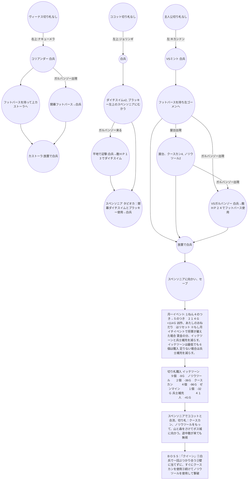
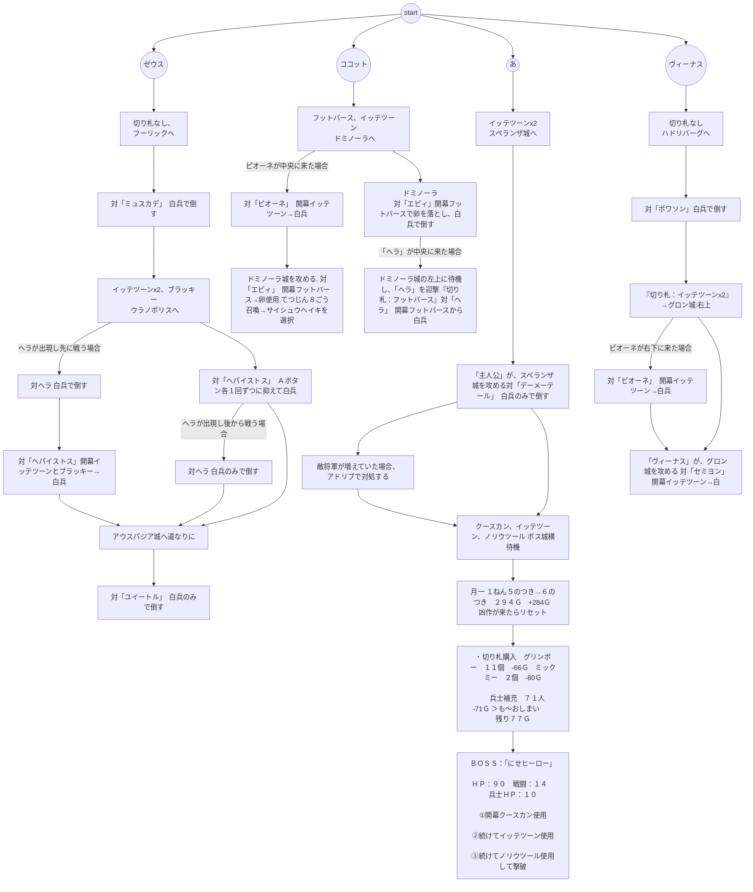

## 1

```mermaid
graph TB
	V((ヴィーナス切り札なし))--右上:ナキューメラ-->VB((コリアンダー 白兵))
	VB-->VC((フットバースを持って上カストーラへ))
	VC-->VD((カストーラ:放置で白兵))
	VB--ガルバンゾー出現-->VE((開幕フットバース→白兵))
	VE-->VD

	C'((ココット切り札なし))--左上:ジョリンギ-->CB((白兵))
	CB-->CC((ダイチスイムx2, ブラッキー左上のスペンソニアにむかう))
	CC--ガルバンゾー来る-->CD((平地で迎撃:白兵→敵ＨＰ１３でダイチスイム))
	CD-->CE
	CC-->CE((スペンソニア タピオカ：開幕ダイチスイムとブラッキー使用→白兵))

	
	A((主人公切り札なし))--左:キカンドン-->B((VSミント 白兵))
	B-->C((フットバースを持ち左ゴーメンへ))
	C--屋台出現-->D((屋台、クースカン4, ノリウツール2))
	C-->E((放置で白兵))
	C--ガルバンゾー出現-->F((VSガルバンゾー 白兵→敵ＨＰ２４でフットバース使用))
	D--ガルバンゾー出現-->F
	D-->E
	F-->E
	E-->G((スペンソニアに向かい、セーブ))
	G-->H["月一イベント:１ねん４のつき→５のつき　２１４Ｇ　+114Ｇ 凶作、あたしのおねだり　はリセット ※もし月イチイベントで将軍が雇えた場合 賃金の分、イッテツーンと兵士補充を減らす。 イッテツーンは最低でも６個は購入 足りない場合は兵士補充を減らす。"]
	H-->J["切り札購入 イッテツーン　　９個　-9Ｇ　ノリウツール　　２個　-36Ｇ　クースカン　　　４個　-96Ｇ　ゼンマイン　　　１個　-32Ｇ 兵士補充　　　　４１人　-41Ｇ"]
	J-->K["スペンソニアでココットと合流、切り札：クースカン、ノリウツールをもって、山と森をさけてボス城に向かう。途中敵が来ても無視"]
	K-->L["ＢＯＳＳ：「クイーン」①白兵で一回ぶつかり合う②壁に当てずに、すぐにクースカンを使用③続けてノリウツールを使用して撃破"]
```

## 2

```mermaid
graph TD
	A((start))-->Z((ゼウス))
	A-->C((ココット))
	A-->S((あ))
	A-->V((ヴィーナス))

	Z-->Z1[切り札なし、<br>フーリックへ]
	C-->C1[フットバース、イッテツーン<br> ドミノーラへ]
	V-->V1[切り札なし<br>ハドリバーグへ]
	S-->S1[イッテツーンx2<br>スペランザ城へ]

	Z1-->Z2[対「ミュスカデ」　白兵で倒す]
	Z2-->Z3[イッテツーンx2、ブラッキー<br> ウラノポリスへ]
	Z3--ヘラが出現し先に戦う場合-->Z3'[対ヘラ 白兵で倒す]
	Z3'-->Z4'[対「ヘパイストス」開幕イッテツーンとブラッキー→白兵]
	Z4'-->Z5
	Z3-->Z4[対「ヘパイストス」　Ａボタン各１回ずつに抑えて白兵]
	Z4--ヘラが出現し後から戦う場合-->Z4''[対ヘラ 白兵のみで倒す]
	Z4''-->Z5
	Z4-->Z5[アウスパジア城へ道なりに]
	Z5-->Z6[対「ユイートル」　白兵のみで倒す]

	C1--ピオーネが中央に来た場合-->C1'[対「ピオーネ」　開幕イッテツーン→白兵]
	C1'-->C2'[ドミノーラ城を攻める. 対「エピィ」　開幕フットバース→卵使用.てつじん８ごう召喚→サイシュウヘイキを選択]

	C1-->C2[ドミノーラ
	対「エピィ」開幕フットバースで卵を落とし、白兵で倒す]
	C2--「ヘラ」が中央に来た場合-->C1''[ドミノーラ城の左上に待機し、「ヘラ」を迎撃『切り札：フットバース』対「ヘラ」　開幕フットバースから白兵]
	
	V1-->V2[対「ポワソン」白兵で倒す]
	V2-->V3[『切り札：イッテツーンx2』→グロン城:右上]
	V3--ピオーネが右下に来た場合-->V3'[対「ピオーネ」　開幕イッテツーン→白兵]
	V3-->V4[「ヴィーナス」が、グロン城を攻める 対「セミヨン」開幕イッテツーン→白]
	V3'-->V4

	S1---->S2[「主人公」が、スペランザ城を攻める対「デーメーテール」　白兵のみで倒す]
	S2-->S2'[敵将軍が増えていた場合、アドリブで対処する]
	S2-->S3[クースカン、イッテツーン、ノリウツール ボス城横待機]
	S2'-->S3
	S3-->S4[月一 １ねん５のつき→６のつき　２９４Ｇ　+284Ｇ 凶作が来たらリセット]
	S4-->S5["・切り札購入　グリンボー　１１個　-66Ｇ　ミックミー　２個　-80Ｇ<br>
	兵士補充　７１人　-71Ｇ ＞も～おしまい　　残り７７Ｇ"]
	S5-->S6["ＢＯＳＳ：「にせヒーロー」<br>
ＨＰ：９０　戦闘：１４　兵士ＨＰ：１０<br>
①開幕クースカン使用<br>
②続けてイッテツーン使用<br>
③続けてノリウツール使用して撃破"]
	

```