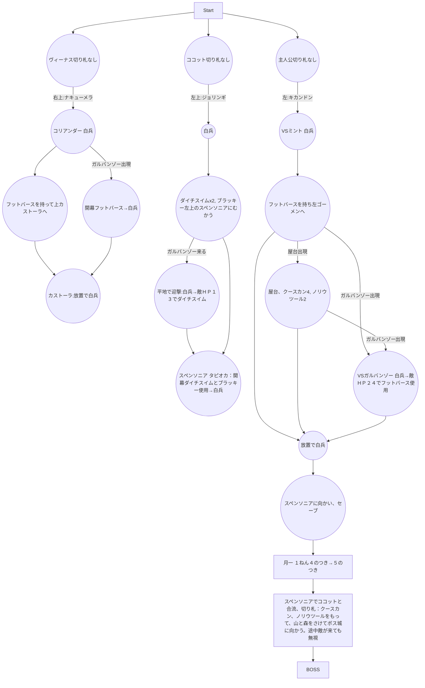

# 1話


## 月一イベント:１ねん４のつき→５のつき　
- ２１４Ｇ　+114Ｇ
- 凶作、あたしのおねだり　はリセット 
- ※もし月イチイベントで将軍が雇えた場合 賃金の分、イッテツーンと兵士補充を減らす
- イッテツーンは最低でも６個は購入 足りない場合は兵士補充を減らす

### 切り札購入 
- イッテツーン　　９個　-9Ｇ
-　ノリウツール　　２個　-36Ｇ
- クースカン　　　４個　-96Ｇ
- ゼンマイン　　　１個　-32Ｇ
- 兵士補充　　　　４１人　-41Ｇ"]
	
## BOSS 「クイーン」
- ①白兵で一回ぶつかり合う
- ②壁に当てずに、すぐにクースカンを使用
- ③続けてノリウツールを使用して撃破

```
【①クイーン＋兵士６人－ぶつかり合い＝７０＋(６０－７)＝１２３】
【②クイーン＋兵士６人－クースカン＝(７０÷２)＋{(５３－２０)÷２}＝５１】
【③クイーン＋兵士４人－ノリウツール＝３５＋１６－５３＝０以下】
```