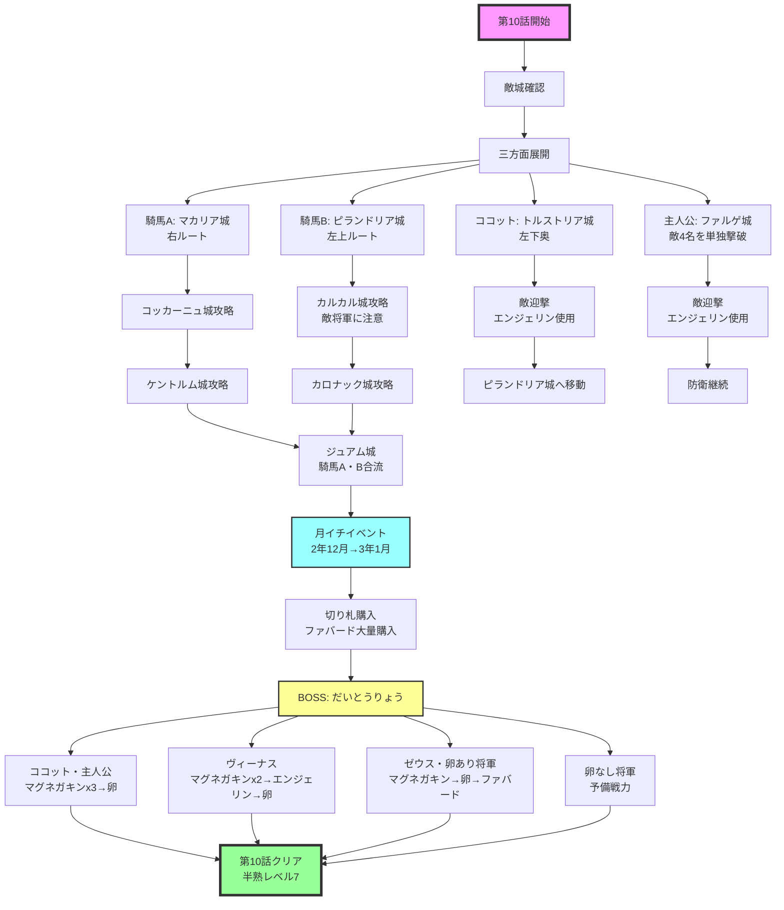

# 第10話　【あんたが大将！大統領！　の巻】　[目標タイム：0:30:00 / 累計3:38:00]

## 先発メンバー
- 騎馬Ａ
- 騎馬Ｂ
- ココット

## 攻略の流れ
- **騎馬Ａ**：右上方面を担当
- **騎馬Ｂ**：左上方面を担当
- **ココット**：左奥のトルストリア城へ
- **主人公**：ファルゲ城（あたしの家右）を攻略
- **ボス城**：将軍全員で攻略

## 重要ポイント

### 主人公のファルゲ城攻略
**敵構成**：
- （城外）ランダム敵
- ランダム敵×3
- エッジ（卵なし）

**攻略戦術**：
- エッジは卵なしのため、切り札不要でエグモンで倒せる
- ランダム敵3人が全員卵ありの場合は難易度上昇
- 基本戦術：
  1. 城外のランダム敵は卵で撃破
  2. 次はファバード使用
  3. 3人目は開幕クースカン→左に押し込まないよう白兵→トドメはブラッキー
- 卵なし将軍やブラッキーで卵を落とせる場合は臨機応変に対応

### エンジェリン事前使用
- 第5話同様、ボス城攻略前にエンジェリンを使用し卵を強化
- ココット：カルカル城（左）から来る敵将軍を利用
- 主人公：ファルゲ城に向かってくる敵将軍を利用

### 月イチのバルムンク
- 月イチでバルムンク入手時は第10話で使用OK
- ラスボスより「だいとうりょう」の方が安定せず手強いため

## 攻略詳細

### ①初動（敵城確認後出撃）
ポーズしながらカーソル移動、攻める敵城の将軍を確認
卵を使われなさそうな場合は『ファバード』を多めに持つ

**騎馬Ａ**
- →マカリア城（右）へ
- 敵：ランダム敵×1、リディア
- 道なりに進む

**騎馬Ｂ**
- →ピランドリア城（左上）へ
- 敵：ランダム敵×2
- 柱の上側の平地を通る（冬なら左の水面から進む）

**ココット**
- →トルストリア城（左下奥）へ
- 敵：ランダム敵×2
- 柱の上側の平地を通る（冬なら左の水面から進む）

**主人公**
- →ファルゲ城（上/あたしの家右）へ
- 敵：ランダム敵×3、エッジ
- 金網は通らない、溶岩は通ってOK
- ファルゲ城から来る敵を倒しつつ進軍

### ②第二波とエンジェリン使用
コッカーニュ城からの敵が下に向かった場合、騎馬Ａは避けずに倒す
他の敵はココット・主人公で迎撃（この時エンジェリン使用）

**騎馬Ａ**
- →コッカーニュ城（右上）へ
- 敵：ランダム敵×2、カイン

**騎馬Ｂ**
- →カルカル城（左上）へ
- 敵：ランダム敵×2、ガーラント
- ※カルカル城からの敵将軍に注意

#### カルカル城からの敵将軍対処
- トルストリア城に向かう場合：ココットで迎撃
- ピランドリア城に向かう場合：騎馬Ｂは敵を避け、ココットが金網と台地の間の平地を通り迎撃

**ココット**
- →城外に出し、左上からの敵将軍を迎撃
- 切り札：『グリンボー、クースカン、エンジェリン』

**主人公**
- →城外に出し、右上からの敵将軍を迎撃
- 切り札：『グリンボー、クースカン、エンジェリン』

### ③第三波
右ルートの騎馬Ａは攻めに集中、敵将軍を避ける
主人公のいるファルゲ城とコッカーニュ城は、主人公と月イチで到着する将軍で防衛

**ココット**
- →敵迎撃後、ピランドリア城（あたしの家左）に移動

**騎馬Ａ**
- →ケントルム城（右上奥）へ
- 敵：ランダム敵×3

**騎馬Ｂ**
- →カロナック城（左上奥）へ
- 敵：ランダム敵×2、レオンハルト

### ④ジュアム城攻略とボス準備
**騎馬Ａ・騎馬Ｂ**
- →ジュアム城（上奥）へ
- 敵：ランダム敵×2、グレイ

**ココット・主人公**
- →ボス城手前で待機
- 切り札：『マグネガキンx3』

## 月イチイベント（２年12月→３年１月）
時報音でセーブ

### 切り札購入
- クースカン：残り10個を切っていたら11個購入（-264G）
- ファバード：買えるだけ購入

### ⑤ボス攻略準備
**ココット・主人公**
- →ボス城へ

**ヴィーナス**
- →ボス城へ
- 切り札：『マグネガキンx2、エンジェリン』

**ゼウス・卵あり将軍**
- →ボス城の門付近で待機
- 切り札：『マグネガキン、ファバードx2』
- ※ハリケーン残り5個以上ならファバードの代わりにハリケーン

**卵なし将軍**
- 自城の防衛
- 切り札：『ファバード』

## BOSS：だいとうりょう
※ボス前の選択肢は「うむッ！」を選択

### ココット・主人公戦術
1. マグネガキンで攻撃をできるだけ下げる
2. 卵使用でエグモン召喚
3. 1～2ターン目にじょうりゅうけんが来れば3つのマグネガキン使用可能
4. なるべく攻撃回数の多い技で攻撃

#### ココットのエグモン
**半熟レベル6～7**：ムーンマッスル
- 下技「ダンベルボム」で攻撃
- HP600切ったら「ムーンライト」で攻撃

**半熟レベル7～8**：スカイプリンセス
- 上技「ナパームだん」で攻撃

エグモンが瀕死時は上技で攻撃
エグモンが倒されたら退却

### ヴィーナス戦術
1. 開幕マグネガキン2個使用
2. エンジェリン使用
3. 卵使用でエグモン召喚
4. エグモンが倒されるまで攻撃
5. エグモンが倒されたら退却

### ゼウス・卵あり将軍戦術
1. マグネガキン2回使用
2. 卵使用でエグモン召喚
3. エグモン倒された後：
   - 兵士が残っている、または敵HP83以下ならファバード
   - 倒せない場合は退却

### 卵なし将軍（万が一のトドメ用）
1. マグネガキン使用
2. ファバード使用
3. ファバード使用

**注意**：1ターン目にズグラーク！が来た場合、ファバード2回目で兵士全滅
（兵士HP10→ズグラーク！で残りHP2→ファバードで残りHP1→ファバードでHP0）

## 第10話終了
- 半熟レベル：7
- 目標タイム：3:38:00

## 攻略フローチャート

