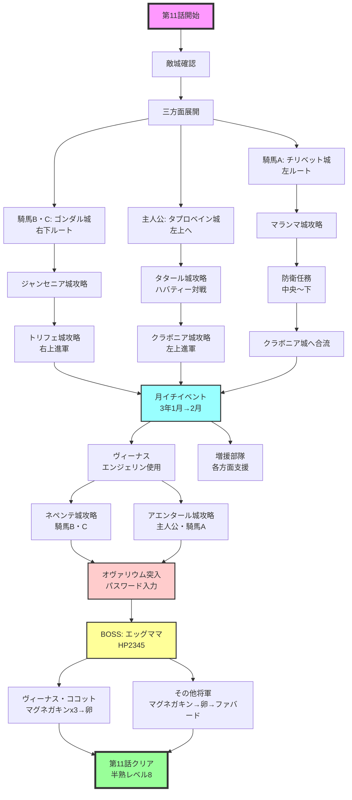

# 第11話　【愛と憎しみの果てに…　の巻】　[目標タイム：0:29:00 / 累計4:07:00]

## 先発メンバー
- 騎馬Ａ
- 騎馬Ｂ
- 騎馬Ｃ（いなければココット）

## 攻略の流れ
- **騎馬Ａ**：左方面を担当
- **騎馬Ｂ・騎馬Ｃ**：右下方面を担当
- **主人公**：中央のタタール城を攻略

### 中盤以降の展開
- **騎馬Ｂ・騎馬Ｃ**：右上方面へ
- **主人公と後発隊**：左上方面を攻略
- **ボス城**：ヴィーナス、主人公、ココットで攻略

## 重要ポイント

### 冬の移動最適化
- 冬はなるべく凍った海を通る
- 時間短縮に効果的

### 敵城の初期配置
- 第11話は全ての敵城で3名が初期配置
- 敵将軍3名を自将軍1人or2人がかりで撃破
- ランダム敵の卵の有無次第では『ファバードx3』も選択肢

### ヴィーナスのエンジェリン使用
- ボス城攻略前に行く前にエンジェリンを使用

### ココットでのボス戦HP管理
- ココットのHP：24
- エッグママの全体攻撃：12ダメージ
- マグネガキンで全体攻撃のダメージは軽減可能だが注意必要
- ボス戦前のセーブ推奨

### 最終話用の切り札確保
最低限残す切り札：
- エンジェリン：2個
- マグネガキン：5個
- ハリケーン：5個

## 攻略詳細

### ①初動（敵城確認後出撃）
ポーズし、敵城の将軍を確認
卵を使われなさそうな場合は『ファバード』を多く持つ

**騎馬Ａ**
- →チリベット城（左）へ
- 敵：ランダム敵×3

**騎馬Ｂ・騎馬Ｃ**
- →ゴンダル城（右下）へ
- 敵：ランダム敵×2、ブリー
- なるべく平地を通る（冬なら下側の水面を通る）

**主人公**
- →タプロベイン城（左上）へ
- 敵：ランダム敵×3

※ゴンダル城から敵将軍がアルマムーンに向かってくる場合、騎馬Ｂ/騎馬Ｃのどちらかで撃退

### ②タタール城攻略
主人公対ハバティーはブラッキーで卵を落とせる

**主人公**
- →タタール城（中央）へ
- 切り札：『ブラッキー、クースカン、ファバード』
- 敵：ランダム敵×2、ハバティー
- 季節に関わらず、迂回せず直線的に向かう

**騎馬Ａ**
- →マランマ城（左上）へ
- 敵：ランダム敵×2、サムソー

**騎馬Ｂ・騎馬Ｃ**
- →ジャンセニア城（右上）へ
- 敵：ランダム敵×3
- なるべく平地を通る（冬なら水面を多めに通る）

### ③三方面展開
- 騎馬Ｂ・騎馬Ｃ：中央から右上に進軍
- 主人公：左上ルートへ
- 騎馬Ａ：中央から下の自城を防衛・城奪還後、左上ルートに合流

**騎馬Ｂ・騎馬Ｃ**
- →トリフェ城（右上）へ
- 上側の水面を通り中央経由、右に進む
- 敵：ランダム敵×2、マリボー

**主人公**
- →クラボニア城（左上）へ
- 敵：ランダム敵×2、リゴット

**騎馬Ａ**
- →中央から下の自城を防衛
- 敵全滅後、クラボニア城（左上）へ

## 月イチイベント（３年１月→２月）
時報音でセーブ
- ヴィーナスが到着しなかった場合、リセットも検討
- 兵士補充：99人（-99G）
- マグネガキン：11個購入（-880G）
- クースカン：残り11個を切っていたら購入

### ④ヴィーナスのエンジェリン使用
**ヴィーナス**
- →城外で敵将軍を迎撃しつつエンジェリン使用
- 切り札：『グリンボー、クースカン、エンジェリン』

**その他の到着将軍**
- →左右ルート（特に左）を攻める

**ココット**
- 城攻めの状況次第で敵城へ
- 余裕があれば中央のタタール城を防衛しつつ『エンジェリン』使用

### ⑤左右奥の敵城攻略とボス準備
**騎馬Ｂ・騎馬Ｃ**
- →ネペンテ城（右上奥）へ
- 敵：ランダム敵×2、エダム

**主人公・騎馬Ａ**
- →アエンタール城（左上奥）へ
- 敵：ランダム敵×2、ラクレット

**ヴィーナス（とココット）**
- →ボス城手前で待機
- 切り札：『マグネガキンx3』
- ※エンジェリンを防衛時に使えなかった場合はエンジェリンも持参

### ⑥オヴァリウム突入
敵城を全て落としたら、全将軍でオヴァリウムへ

**ヴィーナス・ココット**
- →ボス城へ

**ほかの将軍**
- →ボス城へ
- 切り札：『マグネガキン(x2)、(ハリケーン、)ファバード』

※エンジェリン2個、マグネガキン5個、ハリケーン5個は最低限残す
※セーブ必須

### パスワード入力
正しい順番で選択（上から攻め落とした順）：

```
われらが　かんじゅく　せいめいたいの
いだいなる　はは　エッグママの
きゅうでん　オヴァリウムよ　われを
みちびけ
```

選択肢は「うむッ！」を選ぶ

## BOSS：エッグママ
- **HP**：2,345
- **攻撃**：12
- **速さ**：1

### ヴィーナス・ココット戦術
1. マグネガキン3個使用
2. 卵使用でエグモン召喚
3. 防衛時にエンジェリンを使えなかった場合：マグネガキン→エンジェリン→マグネガキン→卵
4. エグモンは倒されるまで攻撃

### ほかの将軍戦術
1. マグネガキン使用
2. 卵使用でエグモン召喚
3. 卵が割られた場合：将軍HPが12以下になるまで「もうこうげき」選択
4. エッグママのHP83以下になったらファバードで撃破

## 第11話終了
- 半熟レベル：8
- 目標タイム：4:07:00

## 攻略フローチャート

