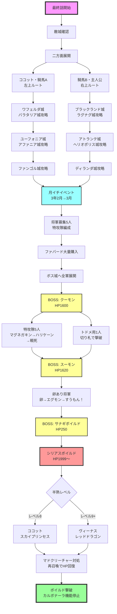

# 最終話　【ああ　世界よ半熟なれ…！！　の巻】　[目標タイム：0:38:00 / 累計4:45:00]

## 先発メンバー
- ココット
- 騎馬Ａ
- 騎馬Ｂ

## 攻略の流れ
- **ココット・騎馬Ａ**：左上方面を担当
- **騎馬Ｂ・主人公**：右上方面を担当

### ボス攻略の配分
- **クーモン**：騎馬Ａ、騎馬Ｂ、特攻用将軍
- **スーモン**：卵あり将軍
- **ボイルド**：ココット（またはヴィーナス）、主人公

## 重要ポイント

### 敵城攻略時の切り札選択
- 最終話はほとんどの敵城が4人配置、2人がかりで攻める
- 基本装備：『ブラッキー、クースカン、ファバード』
- 卵あり敵将軍が少ない場合はファバードを増量
- ボス城左右の城は将軍生成が早いため基本装備推奨

### 卵使用回避テクニック
- 卵あり将軍と戦う時、ファバード2個以上持っていなければ卵は使われない
- 城守り側の戦闘順：攻撃値が低い順

### 主人公の拠点
- ディランダ城（ボス城右）を拠点にする
- ボス城からの敵将軍はディランダ城をほとんど攻めない
- ボス攻略用将軍の安全確保に有効

### 月イチでのボス攻略準備
- クーモン特攻隊：5名
- スーモン用卵あり将軍：3名程度
- 騎馬Ａ・Ｂ・Ｃも卵と能力を考慮して特攻配置

### クーモン攻略
- 卵なし（or弱い卵あり）将軍5人：『マグネガキン、ハリケーン、ファバード』
- トドメ用卵あり将軍1人：『マグネガキン、ファバードx2』
- トドメ用を卵あり将軍にする理由：次のスーモン戦で卵使用のため

### スーモン攻略
- 卵あり将軍が開幕で卵使用、エグモンで削る
- エグモン倒されたらファバード使用、すうもん！で退場

### 騎馬隊のボス城攻略
- 騎馬Ａ・Ｂ・Ｃも敵城攻略次第でボス城手前に待機
- クーモン/スーモンどちらと戦うかは卵の有無、卵補正、募集将軍を考慮

### ボイルド攻略

#### 半熟レベル8の場合
- ココットのエンジェリン→スカイプリンセスで攻略
- 主人公も予備として準備

#### 半熟レベル9以上の場合
- ヴィーナスのエンジェリン→レッドドラゴンで攻略
- 主人公も予備として準備

## 攻略詳細

### ①初動（敵城確認後出撃）
ポーズをかけつつカーソル移動、攻める敵城の将軍を確認
敵将軍の卵次第では『ファバード』複数持参

**ココット・騎馬Ａ**
- →ワフェルダ城（左上）へ
- 敵：ランダム敵×3、マルガリータ

**騎馬Ｂ・主人公**
- →ブラックランド城（右上）へ
- 敵：ランダム敵×3、ジン

### ②第二波（二手分かれも可）
自将軍1人で敵将軍4人を退却せず倒せるなら二手に分かれてOK

**ココット・騎馬Ａ**
- →バラタリア城（左上）へ
- 敵：ランダム敵×3、カミュ
- ※1人で落とせるならココットは上のアファニア城へ

**騎馬Ｂ・主人公**
- →ラグナグ城（右上）へ
- 敵：ランダム敵×4
- ※1人で落とせるなら主人公は上のヘリオポリス城へ

### ③奥地攻略
**騎馬Ａ**
- →ユーフォニア城（左奥）へ
- 敵：ランダム敵×4
- 必要ならココットも向かう

**ココット**（ユーフォニア城が大丈夫なら）
- →アファニア城（上）へ
- 敵：ランダム敵×2、マラスキーノ

**主人公**
- →ヘリオポリス城（上）へ
- 敵：ランダム敵×2、アクアビット

**騎馬Ｂ**
- →アトランテ城（右奥）へ
- 敵：ランダム敵×4
- 退却してでも1人で落とす

### ④上部敵城攻略
騎馬Ａ・Ｂは左右奥の城攻略後、上の敵城攻略に加勢

**ココット・騎馬Ａ**
- →ファンゴル城（左上）へ
- 敵：ランダム敵×3、ラ　ターシュ

**主人公・騎馬Ｂ**
- →ディランダ城（右上）へ
- 敵：ランダム敵×3、バランタイン

## 月イチイベント（３年２月→３月）
時報音でセーブ
- 半熟レベル9以上ならヴィーナス到着必須（または半熟値1,370以上）
- 来なければリセット

### 将軍募集と切り札購入
- 兵士補充：99人
- 将軍募集：5人程度
  - クーモン用特攻隊5人
  - スーモン用卵持ち3人
  - 騎馬Ａ・Ｂ・Ｃも頭数に加えて考慮

#### 将軍選別の注意点
- 卵なし将軍：クーモン用
- まねっこ/カボチャ/キングエッグ：クーモンのトドメ用
- ブラウニー、フェデリーニ：HP低すぎてボス攻略に使用不可
- マフィン、チコリ：クーモン戦使用時は『マグネガキンx2、ファバード』

### 切り札購入
- ファバード：買えるだけ購入

### ⑤全将軍ボス城へ
出撃順：クーモン用→ボイルド用→スーモン用
※スーモン用将軍が先にボス城に着かないよう注意！

**特攻隊5人**
- →ボス城でクーモン攻略
- 切り札：『マグネガキン、ハリケーン、ファバード』

**トドメ用卵あり将軍**
- →ボス城へ
- 切り札：『マグネガキン、ハリケーン（ファバード）、ファバード』

**ココット（半熟レベル8）/ヴィーナス（半熟レベル9以上）**
- →ボス城の右上で待機
- 切り札：『エンジェリンx2、ファバード』

**主人公**
- →ボス城の右上で待機
- 切り札：『エンジェリン、ファバードx2』
- ※バルムンクあればファバード1つと交換

**ほかの卵あり将軍**
- →ボス城でスーモン攻略
- 切り札：『ファバードx3』

## BOSS戦

### クーモン
- **HP**：1,600
- **攻撃**：15
- **速さ**：2

#### 特攻隊5人の戦術
1. マグネガキン使用
2. ハリケーン使用
3. 兵士残存＆HP13以上→もうこうげき
4. 兵士なしorHP12以下→ファバード
5. 退却せず、もうこうげきでクーモンに倒させる

#### トドメ用特攻隊1人の戦術
1. マグネガキン使用
2. ハリケーン使用
3. 倒せていない場合、ファバード使用で撃破

### スーモン
- **HP**：1,620
- **攻撃**：12
- **速さ**：7

#### 戦術
1. 開幕で卵使用
2. 攻撃回数の多い技で削る
3. エグモン倒されたらファバード使用
4. すうもん！で退場

### サナギボイルド
- **HP**：250
- **速さ**：1

スーモンにトドメを刺した将軍は退却

#### 半熟レベル8の場合
**ココット戦術**：
1. 開幕エンジェリン使用
2. 卵使用でスカイプリンセス召喚
3. 上技「ナパームだん」で攻撃

#### 半熟レベル9以上の場合
**ヴィーナス戦術**：
1. 開幕エンジェリン使用
2. 卵使用でレッドドラゴン召喚
3. 下技「マグマふんしゃ」で攻撃

### シリアスボイルド
- **HP**：1,999～
- **攻撃**：15
- **速さ**：0

#### 戦術
- スカイプリンセス：上技「ナパームだん」で攻撃
- レッドドラゴン：下技「マグマふんしゃ」で攻撃

#### HP半分以下（絆創膏2つ）からの戦術
- レッドドラゴン：上技「ウイング」に切り替え
- 理由：マドクリーチャーでエグモンを盾にしてくるため

#### マドクリーチャー対処
1. 一旦卵に戻す
2. 敵エグモンHP345以上ならファバード使用
3. 対エグモン時にエンジェリン使用
4. 卵使用で再召喚（HP擬似回復）

#### オーバーボイルド対策
- 残りHP25％以下の技は444ダメージ
- マドクリーチャー中に再召喚でHP回復して耐える

### 予備戦力（主人公など）
ヴィーナスで倒せなかった場合：
1. セーブしてから攻める
2. エンジェリン使用
3. 卵使用
4. ダメージの多い技で攻撃

## ボイルド撃破
セリフ送り→カルボナーラ機能停止

## 最終話終了
- 目標タイム：4:45:00

## 攻略フローチャート

