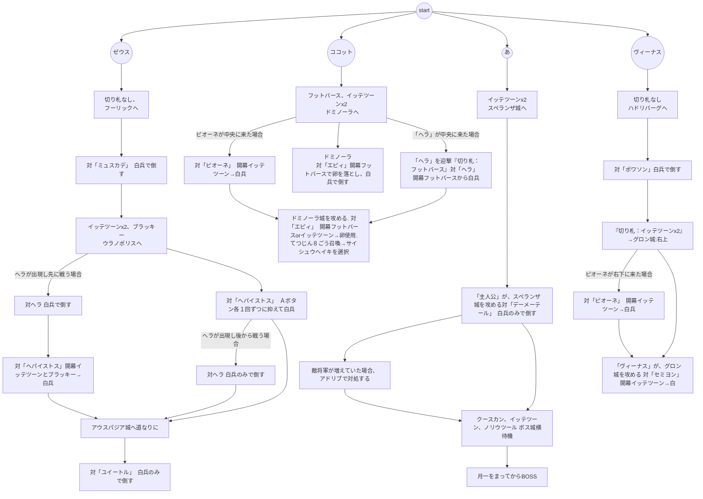

# 2話

## 月一 １ねん５のつき→６のつき　
-２９４Ｇ　+284Ｇ 凶作が来たらリセット
### 切り札購入　
- グリンボー　１１個　-66Ｇ
- ミックミー　２個　-80Ｇ
### 兵士補充　
- ７１人　-71Ｇ
＞も～おしまい　　残り７７Ｇ

## ＢＯＳＳ：「にせヒーロー」
- ＨＰ：９０　戦闘：１４　兵士ＨＰ：１０
- ①開幕クースカン使用
- ②続けてイッテツーン使用
- ③続けてノリウツール使用して撃破
```
【①にせヒーロー＋兵士６人－クースカン＝(９０÷２)＋{(６０－２０)÷２}＝６５】
【②にせヒーロー＋兵士４人－イッテツーン＝４５＋２０－１６＝４９】
【③にせヒーロー＋兵士１人－ノリウツール＝４５＋４－５３＝０以下】
```
