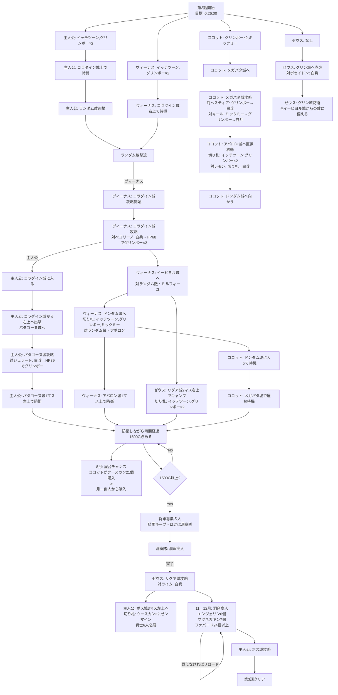

# 3話


## 屋台or月イチ商人でクースカンを２１個買う
クースカンは対将軍戦で便利な切り札。第５・６話用に購入します。
このチャートでは、屋台は１ねん８のつき に、確率で出現するのを狙っています。

# 月一
## １ねん６のつき→７のつき　４７５Ｇ　+398Ｇ
凶作が来たらリセット
月イチ中華商人からクースカンが２１個買える(２５２Ｇ以上ある)場合、買っておく

### 切り札購入
　グリンボー　　　１１個　-66Ｇ

※大豊作で１５００Ｇ以上貯まっても、まだ時間経過させる

＞＞＞も～おしまい　　　残り４０９Ｇ

## １ねん７のつき→８のつき　８０７Ｇ　+398Ｇ
凶作はリセット
月イチ中華商人からクースカンが２１個買える場合、買っておく

※大豊作で１５００Ｇ以上貯まっても、まだ時間経過させる

## １ねん８のつき→９のつき　９５３Ｇ　+398Ｇ
凶作はリセット
兵士夏バテ→バカンスを選択

※分岐あり！
●この時点で、１６００Ｇ以上ある場合
→将軍募集して、騎馬と洞窟隊を登用する
→洞窟隊を洞窟に送る。２ヶ月分の予定を前倒しする
このチャートの１０のつき→１１のつきの月イチまで飛ばす

●まだ１６００Ｇない場合(豊作や大豊作が来ていない場合)
→引き続き、時間経過する

・兵士補充　１１人　-11Ｇ

＞＞＞も～おしまい　　　残り９４２Ｇ

## ＞＞＞１ねん１０のつき→１１のつき　１７３８Ｇ　+398Ｇ
凶作はリセットする

・将軍募集　５人ほど　-250Ｇ-賃金
騎馬は攻略用にキープ。残りは洞窟隊。
(募集後のＧ目安１３９０Ｇ以上)
※１４００Ｇを切らないよう注意

※騎馬が来ない場合
１４００Ｇを切らない程度まで、将軍募集をしてもいい。
それでも来ない場合、騎馬のかわりに戦闘・ＨＰの高い将軍を使う

＞＞＞も～おしまい　　残り１３９０Ｇ以上

## １ねん１１のつき→１２のつき
凶作はリセット
※洞窟で商人に会えるまでリセットを繰り返す
・洞窟商人　-1390Ｇ以上
　エンジェリン　　６個　　-192Ｇ
　マグネガキン　　７個　　-238Ｇ
　ファバード　　　２４個以上買えるだけ買う　-960Ｇ以上

・切り札購入
　ブラッキー　　　２１個　-63Ｇ
　グリンボー　　　１１個　-66Ｇ
・兵士補充　　　　９９人　-99Ｇ

※クースカンが買えなかった場合、グリンボーをさらに３０個買い、『グリンボーx2、ファバード』で第６話終了まで攻略する

＞＞＞も～おしまい


## ■ＢＯＳＳ：「プリンス」
ＨＰ：１００　戦闘：１４　兵士ＨＰ：１００
- ①開幕クースカンを使用
- ②続けてクースカン使用
- ③白兵して壁に当てつつ、敵兵士を１人になるまで減らす
- ④「プリンス」敵兵士１人になったらゼンマインで撃破
```
【①プリンス＋兵士６人－クースカン＝(１００÷２)＋{(６００－２０)÷２}＝３４０】
【②プリンス＋兵士６人－クースカン＝(５０÷２)＋{(２９０－２０)÷２}＝１６０】
【③プリンス＋兵士６人－白兵＝２５＋１３５－１１０＝５０以下】
【④プリンス＋兵士１人－ゼンマイン＝２５＋２５－５０＝０以下】
```
