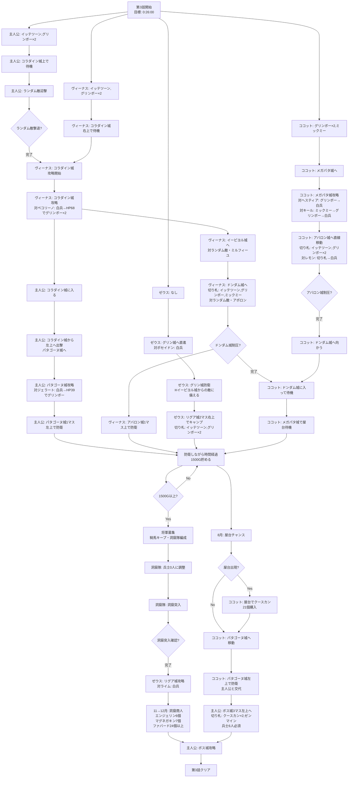

# 3話

```mermaid
graph TD
    Start[第3話開始<br/>目標: 0:26:00]
    
    Start --> HeroStart[主人公: イッテツーン,グリンボー×2]
    Start --> ZeusStart[ゼウス: なし]
    Start --> VenusStart[ヴィーナス: イッテツーン,グリンボー×2]
    Start --> CocotteStart[ココット: グリンボー×2,ミックミー]
    
    %% 第1段階：コラダイン城の連携
    HeroStart --> HeroWait1[主人公: コラダイン城上で待機]
    VenusStart --> VenusWait1[ヴィーナス: コラダイン城右上で待機]
    ZeusStart --> Zeus1[ゼウス: グリン城へ直進<br/>対ポセイドン: 白兵]
    CocotteStart --> Cocotte1[ココット: メガパタ城へ]
    
    HeroWait1 --> HeroBattle1[主人公: ランダム敵迎撃]
    HeroBattle1 --> HeroSignal1{ランダム敵撃退?}
    HeroSignal1 -->|完了| VenusGo1[ヴィーナス: コラダイン城攻略開始]
    
    VenusWait1 --> VenusGo1
    VenusGo1 --> Venus2[ヴィーナス: コラダイン城攻略<br/>対ペコリーノ: 白兵→HP68でグリンボー×2]
    
    Venus2 --> HeroEnter1[主人公: コラダイン城に入る]
    HeroEnter1 --> Hero2[主人公: コラダイン城から左上へ出撃<br/>パタゴーヌ城へ]
    
    %% 第2段階：各自の城攻略
    Hero2 --> Hero3[主人公: パタゴーヌ城攻略<br/>対ジェラート: 白兵→HP39でグリンボー]
    
    Venus2 --> Venus3[ヴィーナス: イーピヨル城へ<br/>対ランダム敵・ミルフィーユ]
    
    Cocotte1 --> Cocotte2[ココット: メガパタ城攻略<br/>対ヘスティア: グリンボー→白兵<br/>対キール: ミックミー→グリンボー→白兵]
    
    Zeus1 --> ZeusWait2[ゼウス: グリン城防衛<br/>※イーピヨル城からの敵に備える]
    
    %% 第3段階：後半の城攻略
    Cocotte2 --> Cocotte3[ココット: アバロン城へ直線移動<br/>切り札: イッテツーン,グリンボー×2<br/>対レモン: 切り札→白兵]
    
    Venus3 --> Venus4[ヴィーナス: ドンダム城へ<br/>切り札: イッテツーン,グリンボー,ミックミー<br/>対ランダム敵・アポロン]
    
    Cocotte3 --> CocotteSignal1{アバロン城制圧?}
    CocotteSignal1 -->|完了| Cocotte4[ココット: ドンダム城へ向かう]
    Venus4 --> VenusSignal1{ドンダム城制圧?}
    VenusSignal1 -->|完了| Cocotte5[ココット: ドンダム城に入って待機]
    
    Cocotte4 --> Cocotte5
    
    %% 防衛フェーズ
    Hero3 --> Hero4[主人公: パタゴーヌ城1マス左上で防衛]
    VenusSignal1 --> Venus5[ヴィーナス: アバロン城1マス上で防衛]
    Cocotte5 --> Cocotte6[ココット: メガパタ城で屋台待機]
    ZeusWait2 --> Zeus2[ゼウス: リグア城2マス右上でキャンプ<br/>切り札: イッテツーン,グリンボー×2]
    
    %% 時間経過と屋台
    Hero4 --> TimePass[防衛しながら時間経過<br/>1500G貯める]
    Venus5 --> TimePass
    Zeus2 --> TimePass
    Cocotte6 --> TimePass
    
    TimePass --> Month8[8月: 屋台チャンス]
    Month8 --> Yatai{屋台出現?}
    Yatai -->|Yes| Cocotte7[ココット: 屋台でクースカン21個購入]
    Yatai -->|No| Cocotte8[ココット: パタゴーヌ城へ移動]
    Cocotte7 --> Cocotte8
    
    Cocotte8 --> Cocotte9[ココット: パタゴーヌ城左上で防衛<br/>主人公と交代]
    Cocotte9 --> Hero5[主人公: ボス城3マス左上へ<br/>切り札: クースカン×2,ゼンマイン<br/>兵士6人必須]
    
    %% 洞窟フェーズ
    TimePass --> GoldCheck{1500G以上?}
    GoldCheck -->|Yes| Recruit[将軍募集<br/>騎馬キープ・洞窟隊編成]
    GoldCheck -->|No| TimePass
    
    Recruit --> CavePrep[洞窟隊: 兵士0人に調整]
    CavePrep --> CaveEnter[洞窟隊: 洞窟突入]
    CaveEnter --> ZeusSignal2{洞窟突入確認?}
    ZeusSignal2 -->|完了| Zeus3[ゼウス: リグア城攻略<br/>対ライム: 白兵]
    
    Zeus3 --> CaveMerchant[11→12月: 洞窟商人<br/>エンジェリン6個<br/>マグネガキン7個<br/>ファバード24個以上]
    
    CaveMerchant --> Boss[主人公: ボス城攻略]
    Hero5 --> Boss
    Boss --> Clear[第3話クリア]

```