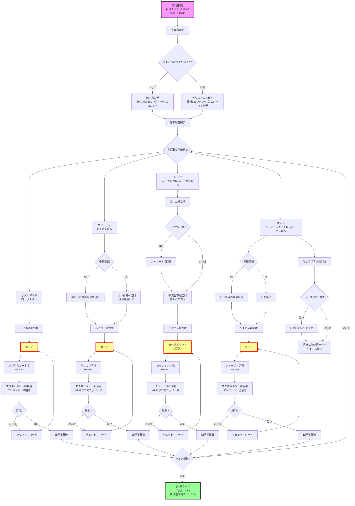
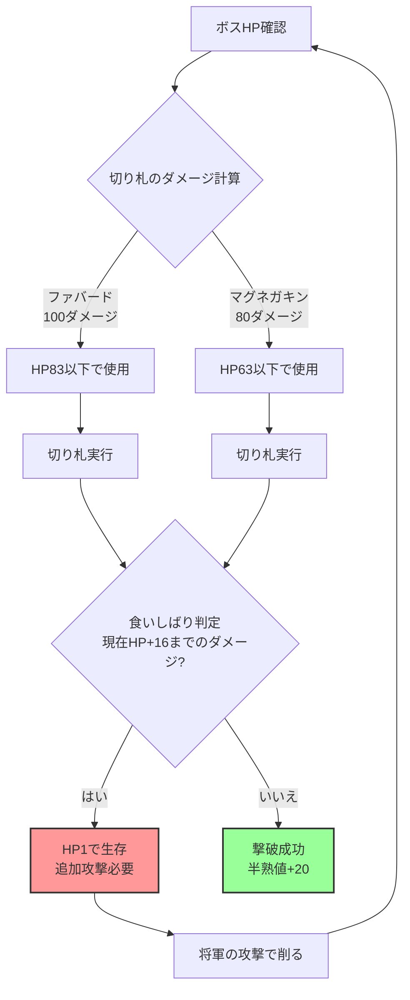

# 第4話 攻略フローチャート

```mermaid
flowchart TD
    Start[第4話開始<br/>目標タイム: 0:18:00<br/>累計: 1:10:00]
    
    Start --> TeamSelect[先発隊選択]
    
    TeamSelect --> CheckGenerals{自軍に特定将軍がいるか?}
    
    CheckGenerals -->|いない| DefaultTeam[御三家先発<br/>ゼウス/卵あり, ヴィーナス, ココット]
    CheckGenerals -->|いる| ReplaceZeus[ゼウスを入れ替え<br/>候補: ビシソワーズ, エシャロット等]
    
    DefaultTeam --> Deploy
    ReplaceZeus --> Deploy
    
    Deploy[将軍配置完了] --> Split{各将軍の移動開始}
    
    Split --> Zeus[ゼウス/卵あり<br/>右上ボス城へ]
    Split --> Venus[ヴィーナス<br/>右下ボス城へ]
    Split --> Cocotte[ココット<br/>左上アルカ城→左上ボス城へ]
    Split --> Hero[主人公<br/>左下ミヒラギアン城→左下ボス城へ]
    
    Venus --> SeasonCheck1{季節確認}
    SeasonCheck1 -->|秋| VenusAutumn[山と川の間の平地を通る]
    SeasonCheck1 -->|冬| VenusWinter[川から海へ迂回<br/>温泉を避ける]
    
    Hero --> SeasonCheck2{季節確認}
    SeasonCheck2 -->|秋| HeroAutumn[川と砂漠の間の平地]
    SeasonCheck2 -->|冬| HeroWinter[川を通る]
    
    Cocotte --> CocotteArka[アルカ城攻略]
    CocotteArka --> CocotteEnemy{ラビオリ出撃?}
    CocotteEnemy -->|はい| CocotteFight[ファバードで迎撃]
    CocotteEnemy -->|いいえ| CocotteMove
    CocotteFight --> CocotteMove[砂漠左下を迂回<br/>左上ボス城へ]
    
    Hero --> HeroMihira[ミヒラギアン城攻略]
    HeroMihira --> HeroEnemy{ランダム敵出撃?}
    HeroEnemy -->|はい| HeroFight[白兵or切り札で迎撃]
    HeroEnemy -->|いいえ| HeroMove
    HeroFight --> HeroMove[洞窟と森の間の平地<br/>左下ボス城へ]
    
    VenusAutumn --> VenusBoss
    VenusWinter --> VenusBoss[右下ボス城到着]
    HeroAutumn --> HeroBoss
    HeroWinter --> HeroBoss[左下ボス城到着]
    CocotteMove --> CocotteBoss[左上ボス城到着]
    Zeus --> ZeusBoss[右上ボス城到着]
    
    CocotteBoss --> SavePoint1[セーブポイント<br/>※重要！]
    VenusBoss --> SavePoint2[セーブ]
    HeroBoss --> SavePoint3[セーブ]
    ZeusBoss --> SavePoint4[セーブ]
    
    SavePoint1 --> BossWinter[ウイナッツォ戦<br/>HP:537]
    SavePoint2 --> BossSummer[サマカンテ戦<br/>HP:614]
    SavePoint3 --> BossAutumn[フォーリシア戦<br/>HP:483]
    SavePoint4 --> BossSpring[スプリミョーネ戦<br/>HP:544]
    
    BossWinter --> WinterStrategy[グランドパパ使用<br/>HP83以下でファバード]
    BossSummer --> SummerStrategy[マグネガキン→卵使用<br/>HP83以下でファバード]
    BossAutumn --> AutumnStrategy[マグネガキン→卵使用<br/>エンジェリン切替可]
    BossSpring --> SpringStrategy[マグネガキン→卵使用<br/>エンジェリン切替可]
    
    WinterStrategy --> BossResult1{勝利?}
    SummerStrategy --> BossResult2{勝利?}
    AutumnStrategy --> BossResult3{勝利?}
    SpringStrategy --> BossResult4{勝利?}
    
    BossResult1 -->|いいえ| Reset1[リセット→ロード]
    BossResult2 -->|いいえ| Reset2[リセット→ロード]
    BossResult3 -->|いいえ| Reset3[リセット→ロード]
    BossResult4 -->|いいえ| Reset4[リセット→ロード]
    
    Reset1 --> SavePoint1
    Reset2 --> SavePoint2
    Reset3 --> SavePoint3
    Reset4 --> SavePoint4
    
    BossResult1 -->|はい| Victory1[四季王撃破]
    BossResult2 -->|はい| Victory2[四季王撃破]
    BossResult3 -->|はい| Victory3[四季王撃破]
    BossResult4 -->|はい| Victory4[四季王撃破]
    
    Victory1 --> CheckAll
    Victory2 --> CheckAll
    Victory3 --> CheckAll
    Victory4 --> CheckAll
    
    CheckAll{全ボス撃破?}
    CheckAll -->|いいえ| Split
    CheckAll -->|はい| Clear[第4話クリア<br/>半熟レベル3<br/>目標達成時間: 1:10:00]
    
    style Start fill:#f9f,stroke:#333,stroke-width:4px
    style Clear fill:#9f9,stroke:#333,stroke-width:4px
    style SavePoint1 fill:#ff9,stroke:#f00,stroke-width:3px
    style SavePoint2 fill:#ff9,stroke:#f00,stroke-width:3px
    style SavePoint3 fill:#ff9,stroke:#f00,stroke-width:3px
    style SavePoint4 fill:#ff9,stroke:#f00,stroke-width:3px
```

## 切り札使用時の注意点

```mermaid
flowchart TD
    CheckHP[ボスHP確認]
    CheckHP --> CalcDamage{切り札のダメージ計算}
    
    CalcDamage -->|ファバード<br/>100ダメージ| Fabard[HP83以下で使用]
    CalcDamage -->|マグネガキン<br/>80ダメージ| Magne[HP63以下で使用]
    
    Fabard --> Execute1[切り札実行]
    Magne --> Execute2[切り札実行]
    
    Execute1 --> CheckKill{食いしばり判定<br/>現在HP+16までのダメージ?}
    Execute2 --> CheckKill
    
    CheckKill -->|はい| Survive[HP1で生存<br/>追加攻撃必要]
    CheckKill -->|いいえ| Defeat[撃破成功<br/>半熟値+20]
    
    Survive --> AdditionalAttack[将軍の攻撃で削る]
    AdditionalAttack --> CheckHP
    
    style Defeat fill:#9f9,stroke:#333,stroke-width:2px
    style Survive fill:#f99,stroke:#333,stroke-width:2px
```