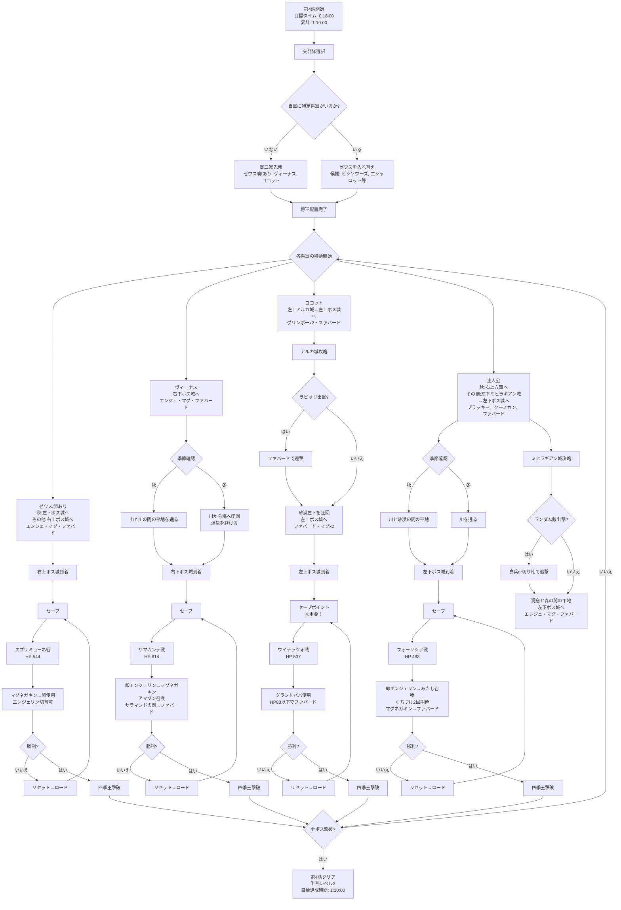
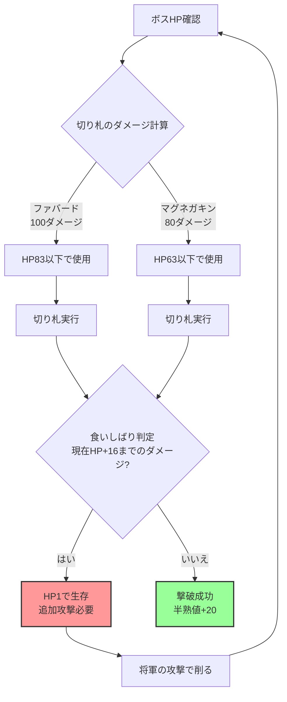

# 第4話 攻略フローチャート

## 切り札使用時の注意点

# ■先発隊の入れ替え
基本的には、御三家の３人を先発にします。
ただし、次の将軍が自軍にいる場合は、「ゼウス」を入れ替えます。

ワンダー補正＋１以上
スーパー補正０
イビル補正＋１

## 入れ替えとエッグモンスター戦略
### →入れ換え候補
- 「ビシソワーズ」「エシャロット」…ワンダー補正１　マシンナイト：上技[ロケットパンチ]で４回攻撃
- 「シェーブル」「レモン」…ワンダー補正２　ダディ：下技[にくあつ]で倍返し、上技[ボディプレス]で１回攻撃
- 「アルテミス」…ワンダー補正３　ドラゴンパピー：上技[ほのおをはく]で全体攻撃(攻撃回数ランダム１～８回)
「アルテミス」はドラゴンパピーを卵に戻した後、卵使用でローラーキラーを出せる：下技[メガトンプレス]で倍返し、上技[ダッシュプレス]で全体攻撃
- 「ガスパチョ」「キッシュ」「アルファルファ」…スーパー補正０　エクスカリバー：下技[マサムネる]で４回攻撃(エンジェリンでスロウケンタ。上技[ばていしゅりけん]で４回攻撃)
- 「ヘーゼル」…イビル補正＋１ エンジェリンでフランソワーズ。下技[すねる]で８回攻撃
### →御三家
・「ゼウス」…ワンダー補正０　ぼーぼーどり：上技[ほのおのはね]で４回攻撃(エンジェリンであたし。上技[くちづけ]で１回攻撃、HP150ダメージ、命中62%)
・「ヴィーナス」…スーパー補正３　ガーコイル：下技[するどいツメ]で３回攻撃(エンジェリンでアマゾン。下技[ガラハドのけん]で４回攻撃、上技[サラマンドのけん]で２回攻撃、先制可能)
・「ココット」…カラフル補正３　グランドパパ：下技[いかる]でＨＰ１３４以下の時チェンジ、チェンジ後の上技[だいげきど]で１６回攻撃

# 自城は防衛しない
　一月クリアを目指します。
アルマムーン城が落とされてもいいように、敵城を落としておきます。

# ●ボス城への移動指定は、必ずボス城の角を指定する
　ボス城からも、敵将軍が出撃してきます。
戦闘を避けるために、城グラフィックの角に向かわせます。

# ●四季王に挑む前に必ずセーブ
　勝てるとは限りません。負けることも多々あります。
ボス城の手前でのセーブを忘れずに！

# できれば切り札撃破を狙う
　切り札でボスを倒すと、半熟値が２０得られます。
ほかの倒し方より１０多く得られるので、狙いたいところ。
次の第５話で半熟レベル４にしたいので、最低でも１体は切り札でトドメを刺したいです。

# 切り札撃破で気をつけること
　ボスやエグモンは全員、ＨＰが１残る、いわゆる食いしばり能力を持っています。
致死ダメージを受けた際、【現在ＨＰ＋１６までのダメージならば、現在ＨＰ－１のダメージに変更】されます。
(例：ボスの現在ＨＰが８４の時、【現在ＨＰ＋１６までのダメージ】＝８４～１００ダメージは、受けてもＨＰ１残ってしまう)
ファバード(１００ダメージ)でトドメを刺す場合、ボスのＨＰは【８３以下】
マグネガキン(８０ダメージ)でトドメを刺す場合、ボスのＨＰは【６３以下】
のときにします。

かなり重要です。少しだけ足りない場合は、将軍のこうげきでＨＰを削ってから切り札使用。

# 戦術
- 開始が秋ならフォーリシアを先に倒し、季節を取り戻してから春
- 冬ならウィナツォを倒し、サマカンテ
- 出現順はランダムなので、ココットからガチャする
- ココットが負けてリセなら別をガチャして順番を入れ替える

## ゼウス対フォーリシア戦術詳細
### 従来の戦術の問題点
- ぼーぼーどり（防御1、HP371）はマグネガキン使用後もかれはのまい（4回攻撃、180-224ダメージ）に耐えられないことが多い
- フォーリシアが先制し、命中率71%のかれはのまいでほぼ確実に倒される

### 改善戦術
1. **即エンジェリン使用**→あたし召喚（防御2、HP770）
2. あたしのくちづけ（150ダメージ、命中62%）を2回狙う
3. 敵HP次第で卵に戻すか戦い続ける
4. マグネガキン使用→ファバードでとどめ

## ヴィーナス対サマカンテ戦術詳細
### 改善戦術
1. **即エンジェリン使用**
2. マグネガキン使用後、アマゾン召喚
3. サラマンドの剣（上技、2回攻撃）で削る - ホットないちげきにも先制可能
4. ファバードでとどめ

