# 第５話　さらば 愛しきエッグマン の巻

**目標タイム: 00:20:00**

## 先発メンバー
- **ココット** (中央から右下担当)
- **騎馬Ａ** (左下担当)
- **ゼウス** (右上担当)

※騎馬がココット以外いない場合、「騎馬Ａ」の代わりに「ヴィーナス」を先発に

## 重要ポイント

### 切り札セット（番号計46）
第５話以降、城攻めの切り札は『ブラッキー、クースカン、ファバード』を基本持たせる
- イッテツーンが余っている場合、ブラッキーの代わりに持つ

### 敵将軍の進路のランダム性
- 第５話以降、敵将軍の出撃・進軍先がランダムになることが多い
- 攻略はアドリブを混ぜていく
- Yボタンでの全体マップを利用して敵将軍の進行状況を把握

### ココットのボス戦準備
- ボス城攻略前にエンジェリンを使用しておく
- ボス戦でエンジェリンを使うと1ターン損してマグネガキンが使えず勝率低下
- 右下の敵城攻略後、敵将軍と1回戦闘して先にエンジェリンを使用
- 切り札『グリンボー、クースカン、エンジェリン』で迎撃

### 12月イベント
- 月イチ前にセーブ
- リセット駆使してサンタからバルムンクを必ず入手（第9話用）

### 城攻め時の注意
- 白兵と切り札で倒せない場合はたまごを使用
- できる限り卵なしの敵将軍に、城の外で使用

## 攻略フローチャート

```mermaid
flowchart TD
    Start[開始<br/>半熟レベル4目標] --> Phase1[第1フェーズ]
    
    %% 第1フェーズ
    Phase1 --> Kokotto1[ココット→テラビル城<br/>中央下<br/>グリンボーx2,ファバード<br/>川沿い移動]
    Phase1 --> Kiba1[騎馬A→ヒュペルボレア城<br/>左下<br/>グリンボーx2,ファバード<br/>直線移動]
    Phase1 --> Zeus1[ゼウス→オトラント城<br/>右上<br/>ファバード<br/>直線移動]
    Phase1 --> Hero1[主人公→カルーン城へ向かう<br/>中央<br/>ブラッキー,クースカン,ファバード<br/>川沿い移動]
    
    %% 敵対処
    Kokotto1 --> KokottoE1{対マスカット}
    KokottoE1 -->|白兵or切り札| Kokotto1End[テラビル城制圧]
    
    Kiba1 --> KibaE1{対マンゴスチン}
    KibaE1 -->|ファバード| Kiba1End[ヒュペルボレア城制圧]
    
    Zeus1 --> ZeusE1{対グレナデン}
    ZeusE1 -->|ファバード| Zeus1End[オトラント城制圧]
    
    %% 第2フェーズ
    Kokotto1End --> Phase2[第2フェーズ]
    Kiba1End --> Phase2
    Zeus1End --> Phase2
    Hero1 --> Phase2
    
    Phase2 --> CheckEnemy{テラビル城から<br/>左上に敵出撃？}
    CheckEnemy -->|Yes| HeroIntercept[主人公で迎撃<br/>ココットは使わない]
    CheckEnemy -->|No| Phase2Continue[続行]
    HeroIntercept --> Phase2Continue
    
    Phase2Continue --> Kiba2[騎馬A→ボッサール城<br/>左下奥<br/>ブラッキー,クースカン,ファバード]
    Phase2Continue --> Kokotto2[ココット→敵将軍迎撃<br/>グリンボー,クースカン,エンジェリン<br/>※エンジェリン使用重要！]
    Phase2Continue --> Zeus2[ゼウス→クロチェット城<br/>右上奥<br/>ブラッキー,クースカン,ファバード]
    Phase2Continue --> Hero2[主人公→カルーン城<br/>中央]
    
    Kokotto2 --> Kokotto2B[アイアイエー城<br/>左下<br/>ブラッキー,クースカン,ファバード]
    Zeus2 --> ZeusE2{対ランプータン}
    ZeusE2 -->|切り札使用| Zeus2End[クロチェット城制圧]
    
    %% 第3フェーズ
    Kiba2 --> Phase3[第3フェーズ]
    Kokotto2B --> Phase3
    Zeus2End --> Phase3
    Hero2 --> Phase3
    
    Phase3 --> Hero3[主人公→ジュメルズ城<br/>右下<br/>ブラッキー,クースカン,ファバード<br/>対ドリアン]
    Phase3 --> Kokotto3[ココット→バスカビル城<br/>右下の島左上<br/>ブラッキー,クースカン,ファバード]
    Phase3 --> Kiba3[騎馬A→自城防衛<br/>グリンボーx3]
    
    Kokotto3 --> KokottoE3{対カシス}
    KokottoE3 -->|ファバードor<br/>クースカン→ブラッキー| Kokotto3End[バスカビル城制圧]
    
    %% 月イチイベント
    Hero3 --> SavePoint1[セーブポイント]
    Kokotto3End --> SavePoint1
    Kiba3 --> SavePoint1
    
    SavePoint1 --> MonthEvent1[12月→1月<br/>サンタ：バルムンク獲得<br/>兵士補充41人 -41G]
    
    %% 第4フェーズ
    MonthEvent1 --> Phase4[第4フェーズ]
    
    Phase4 --> Kokotto4[ココット→プトレマイス城<br/>右下奥<br/>ブラッキー,クースカン,ファバード<br/>対チキータ]
    Phase4 --> Reinforcement[後発隊→奪還城へ<br/>グリンボーx3]
    
    %% レベル確認
    Kokotto4 --> LevelCheck{半熟レベル4？}
    Reinforcement --> LevelCheck
    
    LevelCheck -->|No| GrindPhase[敵城制圧&時間経過<br/>半熟値稼ぎ]
    GrindPhase --> LevelCheck
    
    LevelCheck -->|Yes| Phase5[第5フェーズ<br/>LR同時押し操作]
    
    %% ボス戦準備
    Phase5 --> KokottoBoss[ココット→ボス城周辺待機<br/>マグネガキンx2,ファバード]
    
    KokottoBoss --> SavePoint2[セーブポイント]
    SavePoint2 --> MonthEvent2[1月→2月<br/>お年玉100G獲得]
    
    %% ボス戦
    MonthEvent2 --> FinalCheck{半熟レベル4？}
    FinalCheck -->|No| TimePass[LR同時押しで時間経過]
    TimePass --> FinalCheck
    
    FinalCheck -->|Yes| SaveBoss[ボス城前セーブ]
    SaveBoss --> BossBattle[ボス戦：だいまおう<br/>HP:1218 攻撃:13 速さ:1]
    
    BossBattle --> BossStrategy[開幕マグネガキン<br/>兵士2人以上なら2個目使用<br/>なければ卵使用<br/>ピスクピグプレム→いばらのむち]
    
    BossStrategy --> BossCheck{撃破？}
    BossCheck -->|No,HP83以下| UseGabard[ファバード使用]
    BossCheck -->|No,HP84以上| HeroSupport[ココット退却<br/>主人公突撃<br/>マグネガキン→エンジェリンor卵]
    BossCheck -->|Yes| Victory[第5話クリア<br/>半熟レベル4達成]
    
    UseGabard --> Victory
    HeroSupport --> Victory
    

    

```

## 詳細な攻略手順

### 第1フェーズ：初期展開

#### ココット
- **目標**: テラビル城（中央下）
- **切り札**: グリンボーx2、ファバード
- **移動**: 川沿いを移動、冬は川を利用
- **敵対処**: 
  - ランダム敵：白兵or切り札
  - マスカット：白兵or切り札（グリンボーで卵落とし可）

#### 騎馬A
- **目標**: ヒュペルボレア城（左下）
- **切り札**: グリンボーx2、ファバード
- **移動**: 直線的に移動
- **敵対処**:
  - ランダム敵：白兵or切り札
  - マンゴスチン：ファバードで撃破

#### ゼウス
- **目標**: オトラント城（右上）
- **切り札**: ファバード
- **移動**: 直線的に移動
- **敵対処**: グレナデン：ファバードで撃破

#### 主人公
- **目標**: カルーン城（中央）へ向かう
- **切り札**: ブラッキー、クースカン、ファバード
- **移動**: 川沿いに移動

### 第2フェーズ：中盤展開

#### 特殊対応
テラビル城から左上にランダム敵が出撃した場合：
- 主人公で迎撃（ココットは使わない）

#### ココット（重要）
- **エンジェリン使用準備**
  - 敵将軍がテラビル城に来ている場合：グリンボー、クースカン、エンジェリンで撃退
  - **必ずエンジェリンを使用**（ボス戦準備）
- その後アイアイエー城（左下）へ
- **切り札**: ブラッキー、クースカン、ファバード

#### 騎馬A
- **目標**: ボッサール城（左下奥）
- **切り札**: ブラッキー、クースカン、ファバード

#### ゼウス
- **目標**: クロチェット城（右上奥）
- **切り札**: ブラッキー、クースカン、ファバード
- **敵対処**: ランプータン：切り札使用（ブラッキーで卵落とし可）

#### 主人公
- **目標**: カルーン城（中央）制圧

### 第3フェーズ：終盤準備

#### 主人公
- **目標**: ジュメルズ城（右下、ボス城右下）
- **切り札**: ブラッキー、クースカン、ファバード
- **敵対処**: ドリアン：白兵or切り札

#### ココット
- **目標**: バスカビル城（右下の島、左上）
- **切り札**: ブラッキー、クースカン、ファバード
- **敵対処**: カシス：ファバードorクースカンからブラッキーと白兵
- **注意**: 敵城に3人いる場合は1人出撃を待ってから攻城

#### 騎馬A
- **任務**: 自城防衛（アイアイエー城など）
- **切り札**: グリンボーx3

### 月イチイベント（12月→1月）
- **セーブ必須**
- 凶作はリセット
- サンタからバルムンク獲得（リセット駆使）
- 兵士補充：41人（-41G）

### 第4フェーズ：最終準備

#### ココット
- **目標**: プトレマイス城（右下奥）
- **切り札**: ブラッキー、クースカン、ファバード
- **移動**: 沼地や森を回避
- **敵対処**: チキータ：ファバードorクースカンからブラッキーと白兵

#### 後発隊
- **任務**: 奪われた自城の奪還
- **切り札**: グリンボーx3

### 半熟レベル調整
- レベル4未達の場合：
  - 敵城をすべて落とす
  - ボス城からの敵将軍を倒して半熟値稼ぎ
  - 1か月経過させて収入獲得

### 第5フェーズ：ボス戦準備
- **LR同時押し操作**
- ココット：ボス城周辺で待機
- **切り札変更**: マグネガキンx2、ファバード

### 月イチイベント（1月→2月）
- お年玉イベント：100G獲得
- 半熟レベル4確認

### ボス戦：だいまおう
- **HP**: 1218 / **攻撃**: 13 / **速さ**: 1

#### 戦略
1. **開幕**: マグネガキン使用
2. **2ターン目**: 
   - 兵士2人以上残存：マグネガキン2個目
   - 兵士2人未満：卵使用
3. **攻撃**: ピスクピグプレム→いばらのむち連打

#### 撃破失敗時の対処
- **HP83以下**: ファバード使用
- **HP84以上**: 
  - ココット退却
  - 主人公突撃（マグネガキン→エンジェリンor卵）

## 目標達成
- **第5話クリア**
- **半熟レベル4達成**
- **目標タイム: 1:30:00**
