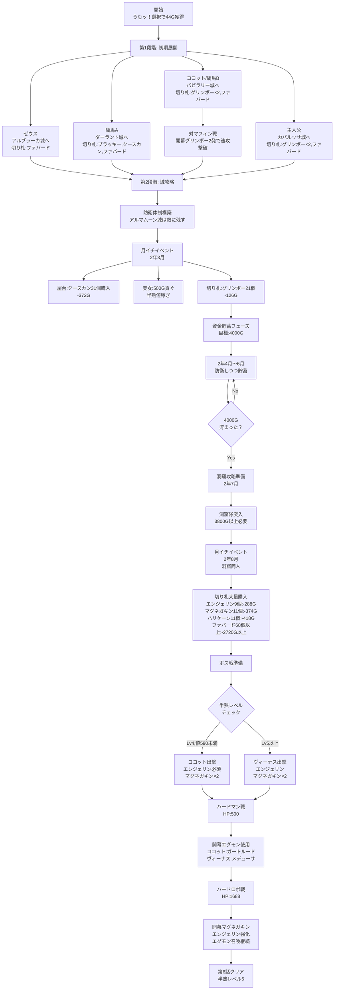

# 第6話【遥かなる たまごの故郷 の巻】[目標タイム: 0:37:00 / 累計: 2:07:00]

## 概要
第6話では終盤までの攻略準備を行う重要な話。騎馬将軍のキープと洞窟での切り札購入が主目的。

## 先発隊編成
- **ゼウス**: 左上方面担当
- **騎馬A**: 下方面担当  
- **ココットor騎馬B**: 下方面担当（バビラリー城速攻用）
- **主人公**: 右奥方面担当

## 重要戦略変更点

### バビラリー城速攻戦術
- **従来**: イッテツーンで卵を落とす or ファバードで倒す
- **新戦術**: ココットに『グリンボー×2、ファバード』を持たせ、開幕グリンボー2発で撃破
  - マフィン（HP15）+ 兵士6人 = 合計HP75
  - グリンボー2発（兵士6人時）= 76ダメージ
  - **約15秒の短縮効果**

## 攻略フローチャート

## 詳細攻略手順

### 序盤（開始～2年2月）

#### ①初期配置と進軍
- **ゼウス** → アルブラーカ城（左上）
  - 切り札: ファバード
  - 対バタール: ファバードで撃破
  
- **騎馬A** → ダーラント城（左下下）
  - 切り札: ブラッキー、クースカン、ファバード
  - 移動: 平地と道を通り下へ
  - 対ブリオッシュ: ファバード使用
  
- **ココットor騎馬B** → バビラリー城（左下左）
  - 切り札: グリンボー×2、ファバード
  - 移動: 平地と道を通り下へ
  - **重要**: 対マフィン戦は開幕グリンボー2発で速攻撃破
  
- **主人公** → カバルッサ城（右下）
  - 切り札: グリンボー×2、ファバード
  - 対ランダム敵: 白兵or切り札使用

#### ②第2次進軍
- **主人公** → オケアナ城（右）
  - 海の細い所を通って右へ
  - 対ランダム敵: 白兵or切り札
  
- **騎馬A** → セレーネ城（右）経由
  - 対バトウラ: 白兵or切り札
  
- **ゼウス** → イカリア城（下）
  - 対バゲット: 切り札使用

### 中盤（2年3月～6月）

#### 月イチイベント管理

| 月 | イベント | 行動 |
|---|---------|------|
| 2年3月 | 屋台/商人 | クースカン31個購入（-372G） グリンボー21個購入（-126G） 将軍募集1人+α |
| 2年4月 | 月イチ | 兵士補充21人 美女来訪時500G貢ぐ（2回まで） |
| 2年5月 | 月イチ | 防衛継続 4000G貯蓄目標 |
| 2年6月 | 月イチ | 将軍募集2人（騎馬3人確保） |

#### 防衛体制
- **アルマムーン城は敵に残す**（資金貯蓄用）
- ゼウス: カバルッサ城周辺防衛（グリンボー×3）
- 騎馬A: アルブラーカ城周辺防衛（グリンボー×3）
- ココット/騎馬B: イカリア城周辺防衛（グリンボー×3）

### 終盤（2年7月～8月）

#### 洞窟攻略（3800G以上必要）
1. 洞窟隊4人編成（グリンボー×3装備）
2. 2年7月末に洞窟突入
3. 2年8月月イチで洞窟商人と会う

#### 洞窟商人購入リスト
| 切り札 | 目標個数 | 費用 |
|--------|----------|------|
| エンジェリン | 9個 | -288G |
| マグネガキン | 11個 | -374G |
| ハリケーン | 11個 | -418G |
| ファバード | 68個以上 | -2720G以上 |
| ブラッキー | 21個（計40個以上） | -63G |
| グリンボー | 11個（計20個以上） | -66G |

追加: 兵士99人補充（-99G）

### ボス戦攻略

#### 将軍選択
- **半熟レベル4（値590未満）**: ココット出撃
  - 切り札: エンジェリン必須、マグネガキン×2
- **半熟レベル5以上**: ヴィーナス出撃
  - 切り札: エンジェリン、マグネガキン×2

#### ハードマン戦（HP:500、攻撃:1、速さ:1）
1. 開幕エグモン使用
   - ココット: ガートルードの「そして わかれ」選択
   - ヴィーナス: メデューサの「おうふくビンタ」選択
2. 2回選択し攻撃
3. HP30以下で生存時: エンジェリン使用→将軍攻撃で撃破

#### ハードロボ戦（HP:1688、攻撃:13、速さ:1）
1. 開幕マグネガキン使用
2. エンジェリン強化→エグモン召喚
   - ココット: ピスクピグプレムの「いばらのむち」選択
   - ヴィーナス: フロストベビーの「オギャー」選択
3. マグネガキン→エンジェリン→マグネガキンの順で使用
4. HP250以下時: 卵に戻してエンジェリン→再召喚も可

## 必須達成項目
1. **騎馬将軍3人確保**（ココット含む）
2. **4000G以上貯蓄**（洞窟商人用）
3. **バビラリー城をグリンボー2発速攻で撃破**

## 推奨達成項目
- クースカン31個購入（屋台or月イチ商人）
- 半熟レベル5到達（月イチイベントで半熟値稼ぎ）
- 美女への貢ぎは2回まで（500G×2）

## 注意事項
- アルマムーン城は最後まで残す（資金貯蓄用）
- 洞窟隊は解雇しない（第7話で使用）
- 屋台出現条件: 現半熟城総数-現在月が0か4の倍数（第6話では3、7、11月）
- 森や山は通らない（移動速度優先）
- 騎馬将軍のIDは裏切りイベント用に確認

## 第6話終了時の状態
- 半熟レベル: 5
- 所持切り札: ファバード68個以上、その他充実
- 将軍: 騎馬3人+洞窟隊残存
- 目標タイム: 2:07:00