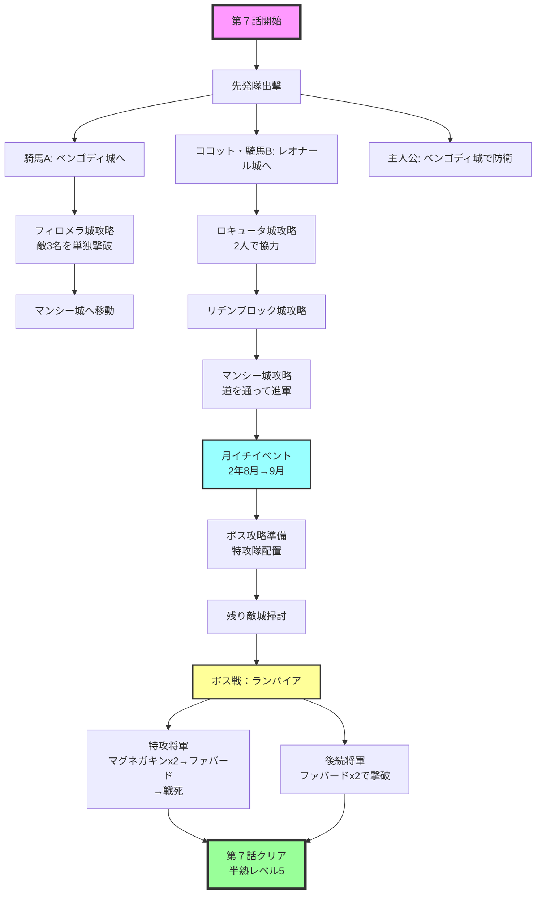

# 第７話　【１３日の死霊の悪夢　の巻】　[目標タイム：0:18:00 / 累計2:25:00]

## 先発メンバー
- 騎馬Ａ
- ココット
- 騎馬Ｂ

## 攻略の流れ
- **騎馬Ａ**：右下方面を担当
- **ココット・騎馬Ｂ**：左上から反時計回り
- **主人公**：ベンゴディ城（あたしの家の右）を防衛
- **ボス城**：特攻用の将軍と将軍（HP多めが良い）で攻略

## 重要ポイント

### 敵城攻めの前準備
- 第７話以降、敵城は３名以上の敵将軍が守っていることが多い
- 敵城を落としきれるよう、誰がいるのか確認し、切り札や卵の使用計画を立てる

### 自将軍２名での敵城攻略
- 左上から反時計回りルートは２人で１つの敵城を落とす
- ２人なら切り札も２倍持てるため、卵あり将軍をファバードで倒し、卵なし/まねっこエッグ持ち将軍を白兵（＋クースカン、ブラッキー）で倒すと安定
- 退却すると半熟値プラス分（将軍撃破やエグモン召喚等）も失われる
- 敵城に敵３名いる場合：１人目はファバード使用後退却、２人目で残り２名を倒すと半熟値ロスが減る

### １人で敵３名以上の城を落とす戦術
フィロメラ城（敵３名）を１人の自将軍で攻め落とす際の切り札使用法：
- **卵あり将軍（戦闘低）**：ファバード（卵を落とせて城も落とせるならブラッキー）
- **卵あり将軍（戦闘高）**：クースカン→白兵で兵士削り→HP22以下でブラッキー
- **卵なし将軍**：なるべく温存、必要時のみ使用（敵兵士削り後に卵使用）

### 切り札の使い方
- 豊作でファバード80個以上購入できた場合、最終的に余ることがある
- 敵城の最後に残る将軍以外が卵なし将軍のみの場合、『ファバードx3』で攻めてもOK
- 遠い城は到着前に卵あり敵将軍が生成される可能性があるため『ブラッキー、クースカン、ファバード』が安定

### ボス攻略での戦死戦術
- ボス「ランパイア」は退却でHP200回復
- 戦死なら回復しないため、１人は切り札使用後に退却せず倒させる

## 攻略詳細

### ①初動（先発隊出撃）
**騎馬Ａ**（せんとうとHP最高）
- →ベンゴディ城（右）へ
- 切り札：『ブラッキー、クースカン、ファバード』
- 対ランダム敵：白兵or切り札
- 対ショコラ：切り札使用

**ココット・騎馬Ｂ**
- →レオナール城（左上）へ
- 切り札：『ブラッキー、クースカン、ファバード』
- 海は通らず迂回して進軍
- 対ランダム敵×2：白兵or切り札
- 対ブラマンジェ：切り札使用

**主人公**
- →ベンゴディ城（右）に入りブックマーク
- 城の下側に待機し防衛
- 切り札：『グリンボーx3』

### ②第二波（敵城確認後）
**騎馬Ａ**
- →フィロメラ城（右下）へ
- 切り札：『ブラッキー、クースカン、ファバード』
- ※敵将軍の確認必須！
- 海を右に避け、森は細い所を通る
- 対ランダム敵×2：白兵or切り札or卵
- 対プラリネ：切り札or卵

**ココット・騎馬Ｂ**
- →ロキュータ城（左上）へ
- 切り札：『ブラッキー、クースカン、ファバード』
- 森は通らず下から迂回
- 対ランダム敵×2：白兵or切り札
- 対シフォン：切り札使用

### ③反時計回り進軍
**ココット・騎馬Ｂ**
- →リデンブロック城（下）へ
- 切り札：『ブラッキー、クースカン、ファバード』
- 対ブラウニー：白兵で倒す（ゾンビは召喚させ、もうこうげきでターン経過）
- 対ランダム敵×2：切り札で倒す

**騎馬Ａ**
- →マンシー城（左下）へ　※中央から左下
- 切り札：『ブラッキー、クースカン、ファバード』

### ④最終進軍
**ココット・騎馬Ｂ**
- →マンシー城（右下）へ　※中央から左下
- 切り札：『ブラッキー、クースカン、ファバード』
- 道を通り敵城へ
- 対ランダム敵×2：白兵or切り札
- 対プラリネ：切り札or卵

※リデンブロック城が左下から狙われても防衛しない

## 月イチイベント（２年８月→９月）
時報音でセーブ
- 凶作、騎馬の裏切りはリセット
- 夏バテ→バカンス選択
- 兵士補充：99人（-99G）
- ※ボス特攻用将軍が来なかった場合は将軍募集

### ⑤ボス攻略準備
**特攻用将軍**
- →ボス城へ
- 切り札：『マグネガキンx2、ファバード』

**将軍（誰でもOK）**
- →ボス城手前で待機
- 切り札：『ファバードx2』

### ⑥残り敵城掃討
**ココット**
- →プルートー城（左下）
- 対ミモザ：ファバードで倒す

**騎馬Ｂ**
- →ハシオクラム城（下）
- 対ランダム敵：白兵or切り札

### ⑦ボス戦
戦死させる将軍が先に攻める
※セーブ必須

## BOSS：ランパイア
- **HP**：426
- **攻撃**：12
- **速さ**：1

**特攻用将軍の戦術**
1. マグネガキン使用
2. マグネガキン使用
3. ファバード使用
4. もうこうげきでターン経過
5. 敵に倒させる（戦死）

**後続将軍の戦術**
1. ファバード使用
2. ファバード使用で撃破

## 第７話終了
- 半熟レベル：5
- 目標タイム：2:25:00

## 攻略フローチャート

