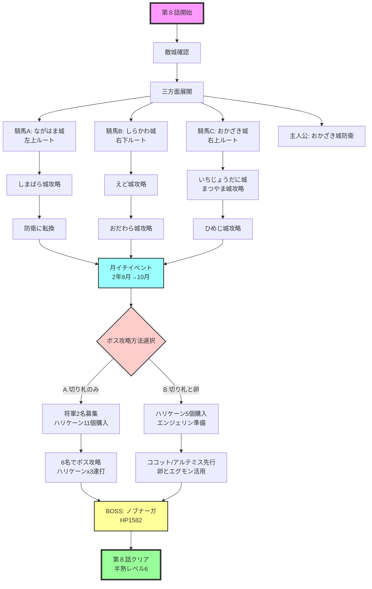

# 第８話　【完熟大将軍の野望　の巻】　[目標タイム：0:23:00 / 累計2:48:00]

## 先発メンバー
- 騎馬Ａ
- 騎馬Ｂ（ココットでも可）
- 騎馬Ｃ

## 攻略の流れ
- **騎馬Ａ**：左上方面を担当
- **騎馬Ｂ**：右下方面を担当
- **騎馬Ｃ**：右上方面を担当
- **主人公**：おかざき城（洞窟下）で防衛
- **ボス城**：主人公と到着した将軍で攻略

## 重要ポイント

### 自将軍１人で３人の敵城を落とす
- 第８話は３方向に将軍を向かわせ、１人で敵３人抜きを実施
- 第７話以上に切り札と卵の配分に注意が必要
- 出撃前と攻め込む直前に敵城の情報を確認
- 一発エッグの敵将軍が多いため、切り札使用が多くなる

### 主人公の防衛戦略
- おかざき城（洞窟下）とし��かわ城（アルマムーン右）を防衛
- ボス城に近いおかざき城をブックマーク
- 右や上から敵将軍が来やすいため、おかざき城で待機し敵に合わせて出撃

### ボス「ノブナーガ」攻略方法

#### A. 切り札のみで倒す（推奨）
**手順**：
1. 月イチでハリケーン11個を購入
2. 将軍を2名募集
3. 計6名に『ハリケーンx3』を持たせて攻略（主人公、到着将軍3名、募集2名）

**所要時間**：約6分（将軍募集含む）

**長所**：
- 運要素が少なく安定
- 将軍2名募集可能（強い騎馬も期待できる）

**必要資金**：1,150G（ハリケーン代＋将軍募集代）

#### B. 切り札と卵で倒す
**前提条件**：
- 半熟レベル6
- ココットが卵割れずにボス城近くにいる、またはアルテミスがいる

**手順**：
1. ココット/アルテミスに『エンジェリン、マグネガキン、ファバード』を持たせる
2. 予備として主人公と卵あり将軍も『ハリケーンx2、ファバード』を持たせる
3. 切り札と卵を駆使して撃破

**所要時間**：3分～7分超（運次第）

**長所**：
- 早く倒せる可能性あり
- 資金が少なく済む

**短所**：
- 安定感がない（状態異常で大幅タイムロス）

## 攻略詳細

### ①初動（敵城確認後出撃）
ポーズをかけつつカーソル移動し、敵城の将軍を確認してから出撃

**騎馬Ａ**
- →ながはま城（左上）へ
- 切り札：『ブラッキー、クースカン、ファバード』
- （城外で）対ランダム敵：白兵or切り札
- 対ランダム敵×2：白兵or切り札or卵

**騎馬Ｂ**
- →しらかわ城（右）へ
- 切り札：『ブラッキー、クースカン、ファバード』
- 対ランダム敵×2：白兵or切り札or卵
- 対グリッシーニ：切り札使用

**騎馬Ｃ・主人公**
- →おかざき城（右上/洞窟下）へ
- 切り札：『ブラッキー、クースカン、ファバード』
- 対ランダム敵：白兵or切り札
- 対シュガー：切り札使用
- ※主人公はおかざき城で待機し防衛

### ②第二波
**騎馬Ｃ**
- →いちじょうだに城（上/洞窟上）へ
- 切り札：『ブラッキー、クースカン、ファバード』
- 対ランダム敵：白兵or切り札
- 対コンポート：切り札使用

### ③三方面展開
敵の移動に注意。右下からくる敵、中央に向かう敵は要注意
主人公も使いつつ、しっかり迎撃

**騎馬Ｂ**
- →えど城（右下奥）へ
- 切り札：『ブラッキー、クースカン、ファバード』
- 対ランダム敵×3：白兵or切り札or卵

**騎馬Ｃ**
- →まつやま城（上）へ
- 切り札：『ブラッキー、クースカン、ファバード』
- 対ランダム敵：白兵or切り札or卵
- 対マサラ：切り札使用

**騎馬Ａ**
- →しまばら城（左上奥）へ
- 切り札：『ブラッキー、クースカン、ファバード』
- 対ランダム敵×2：白兵or切り札or卵
- 対バラクーダ：白兵or切り札or卵

### ④最終攻略
敵の進軍、迎撃が激しいと月イチ前に進まないこともある

**騎馬Ｂ**
- →おだわら城（上/右奥）へ
- 切り札：『ブラッキー、クースカン、ファバード』
- 対ギー：切り札使用

**騎馬Ｃ**
- →ひめじ城（右上奥）へ
- 切り札：『ブラッキー、クースカン、ファバード』
- 対ランダム敵×2：白兵or切り札or卵
- 対キャロット：切り札使用

**騎馬Ａ**
- →いちじょうだに城（洞窟上）の防衛へ
- 切り札：『グリンボーx3』or『ブラッキー、クースカン、ファバード』

## 月イチイベント（２年９月→10月）
時報音でセーブ
- 凶作はリセット

### A. 切り札のみで倒す場合
- 将軍募集：2名（ボス攻略用、退却するので能力不問）
- ハリケーン：11個購入（-1,012G）
- 兵士補充：99人（-99G）

### B. 切り札と卵で倒す場合
- 将軍募集しない
- ハリケーン：5個購入（-460G）
- 兵士補充：99人（-99G）

### ⑤ボス攻略

#### A. 切り札のみで倒す場合
- 募集将軍、到着将軍、主人公、騎馬Ｂ→ボス城へ
- 全員切り札：『ハリケーンx3』

#### B. 切り札と卵で倒す場合
- ココット（アルテミス）→ボス城へ
  - 切り札：『マグネガキン、エンジェリン、ファバード』
- ほかの将軍→ボス城へ（予備）
  - 切り札：『ハリケーンx2、ファバード』

## BOSS：ノブナーガ
- **HP**：1,582
- **攻撃**：11
- **速さ**：1

### A. 切り札のみで倒す場合
1. ハリケーン3個使用→退却を繰り返す
2. ナーガいもで動けなくなったら退却
3. 7人で倒しきれない場合は、キャンプで兵士とハリケーンを集めて再攻撃
4. ハリケーン16個（100ダメージ×16）で撃破可能
5. ※ノブナーガは退却時HP回復なし

### B. 切り札と卵で倒す場合（半熟レベル6前提）

#### ココット戦術
**召喚可能エグモン**：
- 5回：ムーンマッスル
- 4回：さすらいマンボー
- 3回：てつじん８ごう

**手順**：
1. 1ターン目に卵使用
2. さすらいマンボーの上技「あのひのおもい」で削る
3. HP260以下で卵に戻す
4. マグネガキン→エンジェリン→卵使用
5. ムーンマッスルの上技「ムーンライト」で削る
6. 適宜卵に戻し、再召喚で攻撃継続

#### アルテミス戦術
**召喚可能エグモン**：
- 5回：あたし
- 4回：ハニワゴーレム
- 3回：マシンナイト

**手順**：
1. 1ターン目マグネガキン使用
2. 2ターン目卵使用
3. 各エグモンの技で削る
4. HP260以下で卵に戻す
5. エンジェリン使用後、再召喚

**共通**：
- 敵HP84以下ならファバードで撃破
- 倒しきれない場合は予備軍の切り札で削る

## 第８話終了
- 半熟レベル：6
- 目標タイム：2:48:00

## 攻略フローチャート

