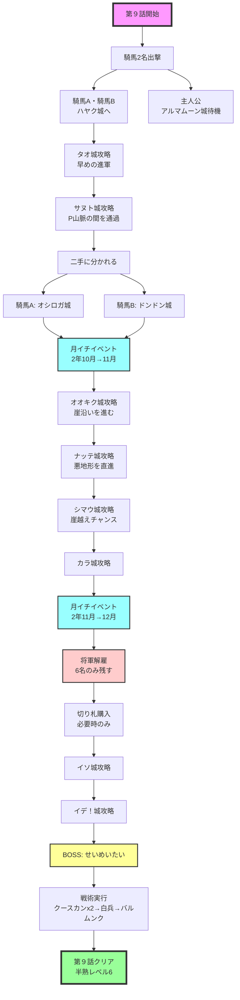

# 第９話　【震える大地…　寒いわけじゃない！　の巻】　[目標タイム：0:20:00 / 累計3:08:00]

## 先発メンバー
- 騎馬Ａ
- 騎馬Ｂ

## 攻略の流れ
- **騎馬Ａ・騎馬Ｂ**：２人協力で攻略
- **主人公**：アルマムーン城で待機
- **ボス城**：騎馬のどちらかが攻略

## 重要ポイント

### 騎馬２人での電撃戦
- 騎馬Ａ・騎馬Ｂの２人がかりで敵城を攻め、攻略
- 第７話同様、敵城が３人の場合は【１人倒して退却→残り２人を倒す】で半熟値ロス削減
- 卵を使わずに騎馬１人で敵将軍３人を倒すのが理想

### 城外の敵将軍対処
- 先に行く騎馬将軍：敵将軍を避けつつ進軍
- 後ろを行く騎馬将軍：城外の敵将軍を撃破

### 裏切り用将軍と余り将軍の解雇
- ボス城攻略直前の月イチ（第９話の２回目）で実施
- 残す将軍：
  - 御三家
  - 騎馬２名
  - もう１名の騎馬（いれば）
  - 敵に回したくない卵あり将軍
- その他の余り将軍は解雇

### 不要な切り札を捨てる小技
- 第３話や第６話で入手した『ころぼぐんだん』など不要な切り札がある場合
- 月イチ前に不要将軍に持たせて城外に出し、月イチで解雇すれば捨てられる

## 攻略詳細

### ①初動
**騎馬Ａ・騎馬Ｂ**
- →ハヤク城（上）へ
- 切り札：『ブラッキー、クースカン、ファバード』
- 砂漠の右を通り、森と山の間を抜ける
- 対ランダム敵×2：白兵or切り札
- 対エストラゴン：切り札使用

**主人公**
- アルマムーン城で待機

### ②第二波
早めの進軍でタオ城に敵将軍が生成される前に攻めたい

**騎馬Ａ・騎馬Ｂ**
- →タオ城（上）へ
- 切り札：『ブラッキー、クースカン、ファバード』
- 湖の下の平地を通り、崖の角から湖を渡る
- 対ランダム敵×2：白兵or切り札
- 対マーマレード：切り札使用

### ③サヌト城攻略
早送り中も敵将軍の進軍に注意

**騎馬Ａ・騎馬Ｂ**
- →サヌト城（上）へ
- 切り札：『ブラッキー、クースカン、ファバード』
- P山脈の間（上側）の平地まで一直線、その後左上へ
- 対ランダム敵：白兵or切り札

### ④二手に分かれる
※サヌト城右上の平地は狭く通りにくい（要練習）

**騎馬Ａ**
- →オシロガ城（上）へ
- 切り札：『ブラッキー、クースカン、ファバード』
- なるべく平地を通り上へ
- 対ランダム敵：切り札使用

**騎馬Ｂ**
- →ドンドン城（右下）へ
- 切り札：『ブラッキー、クースカン、ファバード』
- なるべく平地を通り、崖に注意して右下へ
- 対ランダム敵：白兵or切り札

## 月イチイベント（２年10月→11月）
時報音でセーブ

### ⑤城外敵将軍への対処
後ろから行く騎馬が城外の敵将軍を倒す

**騎馬Ａ・騎馬Ｂ**
- →オオキク城（下）へ
- 切り札：『ブラッキー、クースカン、ファバード』
- 左側の崖に沿って平地を進む
- 対ランダム敵：白兵or切り札

### ⑥悪地形突破
ここからは悪い地形を迂回しない

**騎馬Ａ・騎馬Ｂ**
- →ナッテ城（左下）へ
- 切り札：『ブラッキー、クースカン、ファバード』
- 直線に進む
- 対ジキタリス：白兵or切り札

### ⑦崖越えチャレンジ
敵軍の進軍次第では崖越えを狙える

**騎馬Ａ・騎馬Ｂ**
- →シマウ城（右下）へ
- 切り札：『ブラッキー、クースカン、ファバード』
- 直線に進む
- 対オレガノ：切り札使用

#### 崖越えテクニック
前提条件：敵将軍がこちらの自城に向かってきている
1. 自将軍を右の崖に向かって移動指定し、強制的なキャンプ状態にする
2. 向かってきた敵将軍と戦闘になる
3. すぐ退却する
4. うまくいけば崖を越えて右側に退却できる

### ⑧カラ城攻略
カラ城攻略を後ろの騎馬に任せ、前を行く騎馬は先の敵城に向かってもOK

**騎馬Ａ・騎馬Ｂ**
- →カラ城（右）へ
- 切り札：『ブラッキー、クースカン、ファバード』
- 直線に進む
- 対サフラン：切り札使用

## 月イチイベント（２年11月→12月）
時報音でセーブ

- 兵士補充：99人
- 将軍解雇：
  - 残す：御三家＋騎馬2名＋騎馬1名（いなければ飼い殺し将軍）計6名
  - 他は全員解雇

### 切り札購入（必要時のみ）
ブラッキー個数≦クースカン、またはグリンボー個数≦9個の場合：
- ブラッキー：31個購入
- グリンボー：11個購入

### ⑨イソ城攻略
**騎馬Ａ・騎馬Ｂ**
- →イソ城（上）へ
- 切り札：『ブラッキー、クースカン、ファバード』
- 直線に進む
- 対ローズマリー：切り札使用

### ⑩イデ！城攻略
**騎馬Ａ・騎馬Ｂ**
- →イデ！城（上）へ
- 切り札：『ブラッキー、クースカン、ファバード』
- 直線に進む
- 対アニス：切り札使用

### ⑪ボス城攻略
**先を行く騎馬**
- →ボス城（右上）へ
- 切り札：『クースカンx2、バルムンク』

## BOSS：せいめいたい
- **HP**：500
- **戦闘**：9
- **兵士HP**：100

### 攻略手順
1. 開幕クースカン使用
2. 続けてクースカン使用
3. 白兵で2回ぶつかる（戦闘1の騎馬は4回、戦闘2～5の騎馬は3回）
4. バルムンク使用で撃破

### ダメージ計算
- ①せいめいたい＋兵士6人－クースカン＝(500÷2)＋{(600-20)÷2}＝540
- ②せいめいたい＋兵士6人－クースカン＝(250÷2)＋{(290-20)÷2}＝260
- ③せいめいたい＋兵士6人－白兵＝125＋135-10＝250
- ④せいめいたい＋兵士6人－バルムンク＝125＋125-250＝0以下

※セリフで選択肢がある場合はAボタン連打でOK

## 第９話終了
- 半熟レベル：6
- 目標タイム：3:08:00

## 攻略フローチャート

